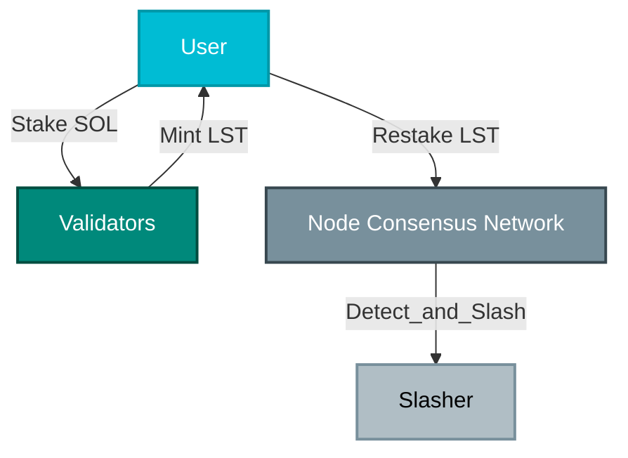
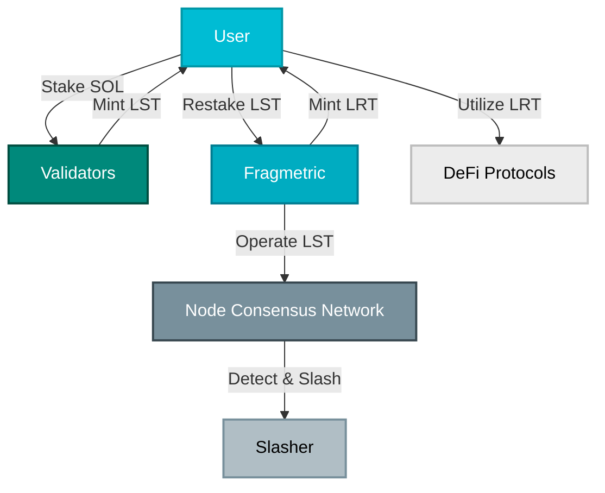

## Restaking

Restaking involves staking an already staked asset (like an LST, e.g., jitoSOL) to secure an additional decentralized service. First introduced by EigenLayer, restaking has evolved to support not only Liquid Staking Tokens (LSTs) but also various other tokens as collateral. This approach enables users to earn additional fees from the new service on top of their standard staking rewards.

## Liquid Restaking Token (LRT)

A Liquid Restaking Token, or LRT, represents the assets you have restaked via a specific protocol—such as Fragmetric—and functions similarly to a Liquid Staking Token within the DeFi ecosystem. For instance, fragSOL, the first LRT offered by Fragmetric, generates additional revenues beyond standard Solana validation and MEV rewards.
