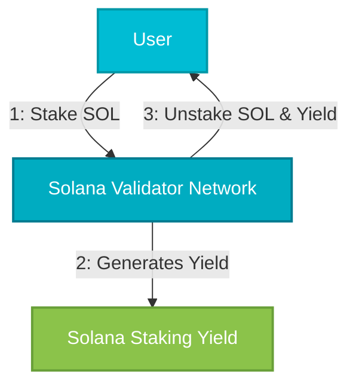
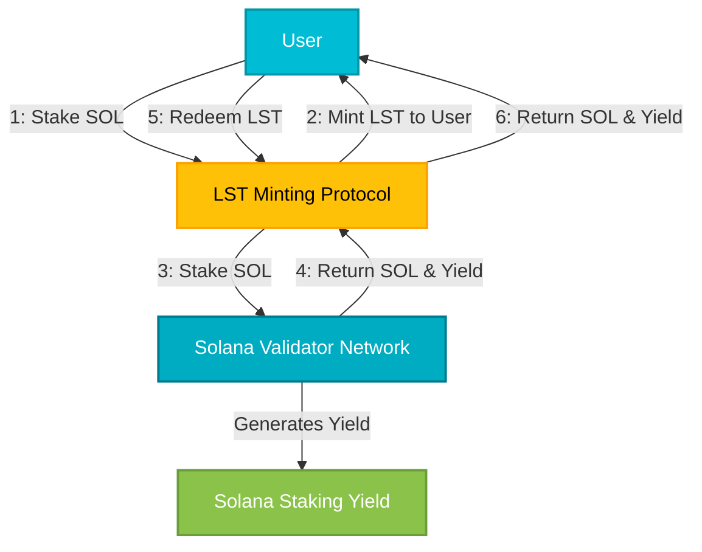

## Staking

Staking on Solana involves locking up SOL tokens with validators to support network security and decentralization. Validators are responsible for processing transactions, maintaining blockchain integrity, and are rewarded in SOL tokens. Users who delegate their SOL to validators earn staking yields, incentivizing active participation in securing the network.

## Liquid Staking Token (LST)

A **Liquid Staking Token (LST)** represents SOL staked through liquid staking protocols such as Marinade (mSOL) or Jito (jitoSOL). LSTs enable holders to maintain liquidity while earning staking rewards, effectively combining the benefits of staking with DeFi flexibility. Users can freely trade or use these tokens in DeFi applications, maximizing their capital efficiency.
