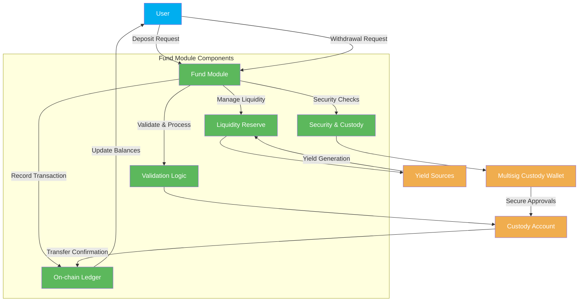

# **FRAG-22 : Fund Module**

---

## **Overview**

The Fund module serves as the core custody, liquidity management, and accounting engine within the FRAG-22 ecosystem. It securely manages user deposits and withdrawals, maintains precise on-chain records, and ensures liquidity efficiency. By providing robust fund management and transparent accounting, it lays the foundation for secure and efficient decentralized asset management.

**Required diagram**:

- **Architecture Overview**: A high-level diagram illustrating interactions between users, Fund module components, and external entities.

---

## **Asset Deposits**

### **Supported Assets and Validation Rules**

The Fund module specifies the assets that users can deposit, verifying eligibility, validating transaction authenticity, and ensuring that only supported tokens are accepted into the Fund reserve.

### **Deposit Procedure and Custody Mechanism**

Upon user deposit initiation, funds are securely transferred to the custody account. The module confirms the transfer, updates on-chain records, and triggers the reward tracking mechanisms within FRAG-22.

**Required diagram**:

- **Deposit Procedure Sequence**: A sequence diagram showing interactions between users, Fund custody accounts, validation logic, and on-chain ledger updates.

---

## **Withdrawal Management**

### **User Withdrawal Requests and Processing Flows**

The Fund module handles withdrawal requests by verifying user balances, checking liquidity reserves, and processing withdrawals in defined batches to optimize transaction efficiency and minimize liquidity disruptions.

**Required diagram**:

- **Withdrawal Request Flowchart**: Flowchart depicting the process from withdrawal request initiation through verification and final settlement.

### **Liquidity Reserve Maintenance**

The Fund module maintains liquidity reserves based on dynamically adjusted thresholds, ensuring adequate funds are always available for user withdrawals while optimizing yield-generation opportunities.

**Required diagram**:

- **Liquidity Reserve Management Diagram**: Structural diagram illustrating dynamic thresholds and rebalancing logic.

---

## **Accounting & Recordkeeping**

### **On-chain Ledger Transparency and Auditability**

The module leverages Solana’s efficient on-chain ledger capabilities to track every deposit, withdrawal, and balance adjustment, providing complete transparency and auditability for all Fund transactions.

**Required diagram**:

- **On-chain Ledger Structure**: Diagram highlighting ledger structures, transaction recording, and data flow for auditability.

### **Real-time Balance Tracking**

Real-time calculations update balances instantly upon any fund activity. Users can verify these balances through the decentralized application, ensuring immediate visibility into their holdings.

**Required diagram**:

- **Real-time Balance Calculation Sequence**: A sequence diagram demonstrating interactions between the Fund module, ledger updates, and user interfaces.

---

## **Security & Custody**

### **Secure Fund Custody and Transaction Validations**

The Fund module employs rigorous security measures, including multisig custody accounts, transaction authenticity checks, and risk management protocols to safeguard user assets from potential threats.

**Required diagram**:

- **Custody Security Architecture**: Structural diagram showcasing multisig custody mechanisms and security layers protecting the Fund.

### **Asset Management Best Practices**

Clear guidelines and best practices are enforced within the module, governing all asset movements, minimizing risks, and ensuring compliance with established security protocols.

**Required diagram**:

- **Asset Movement and Management Workflow**: Detailed workflow diagram illustrating enforced asset management rules, approval layers, and best-practice compliance mechanisms.

---

## **User Interaction**

### **Deposit and Withdrawal User Flow (UI Perspective)**

From initiating transactions to receiving confirmations, the Fund module provides intuitive user interfaces designed for simplicity and efficiency. Each step is clearly communicated and transparently executed.

**Required diagram**:

- **User Interaction Flowchart**: A detailed flowchart showing the user interaction path through the deposit and withdrawal process from the frontend perspective.

### **Transparency and Auditing Procedures**

User-friendly tools for transparency and self-auditing allow users and third-party auditors to easily verify transaction accuracy, reward calculations, and asset custody details.

**Required diagram**:

- **Transparency & Audit Procedure Sequence**: A sequence diagram detailing the process through which users or auditors can verify Fund module activities and records.