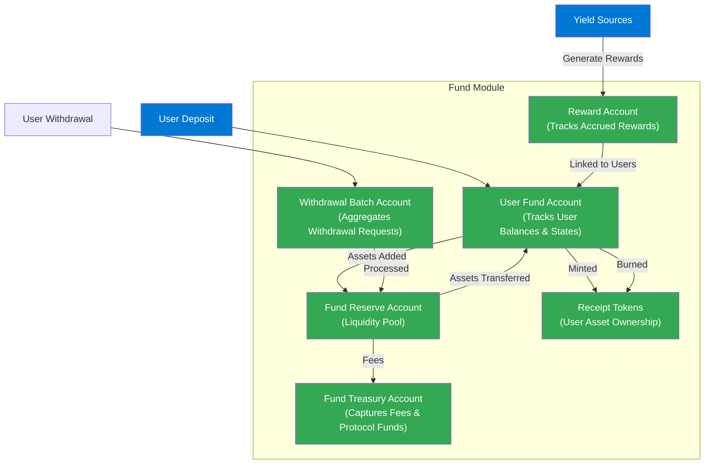

## **Accounting & Recordkeeping**

This section details how the Fund module of the FRAG-22 architecture meticulously tracks every operation, ensuring transparent, accurate, and reliable management of user funds. The structure described here directly reflects the logic implemented in the FRAG-22 codebase.

### **On-chain Accounting Structure**

The Fund module maintains precise records of all operations—**deposits, withdrawals, asset allocations**, and **balance adjustments**. Each transaction is systematically accounted for, ensuring accurate financial tracking and user transparency.

#### **Key Accounting Components:**

- **User Fund Accounts**
  - Maintains individual user balances and withdrawal states.
  - Reflects users’ deposited assets, receipt token balances, and pending withdrawals.
- **Receipt Tokens**
  - Tokens issued to users upon deposits.
  - Represent proportional ownership of deposited assets.
  - Burned upon withdrawal, reflecting accurate ownership and fund valuation.
- **Fund Reserve Account**
  - Manages liquid assets held directly within the Fund for quick withdrawals.
  - Acts as the primary liquidity buffer for immediate transactions.
- **Fund Treasury Account**
  - Captures fees and protocol-specific funds separate from user assets.
- **Withdrawal Batch Account**
  - Temporarily aggregates withdrawal requests into grouped batches.
  - Contains metadata such as timestamps, total batch amounts, and processing status.
- **Reward Account**
  - Separately maintains accrued rewards generated by yield sources.
  - Linked to user reward accounts for accurate claim tracking.

### **Accounting Procedures & Data Flow**

The accounting processes within FRAG-22 are designed around explicit, verifiable flows of asset data. Each action triggers a series of structured record updates:

#### **Deposit Accounting Process:**

1. **Deposit Validation**
   - Verify user identity, deposit asset validity, and transfer authenticity.
2. **Receipt Token Issuance**
   - Mint new receipt tokens proportional to the user’s deposited assets.
3. **Update User Fund Account**
   - Increase the user’s balance according to deposited assets and issued receipt tokens.
4. **Update Fund Reserve Account**
   - Add deposited assets directly to liquidity reserves.

#### **Withdrawal Accounting Process:**

1. **Withdrawal Request Logging**
   - Upon user request, the system logs:
     - User identifier
     - Requested amount & asset
     - Timestamp & withdrawal request ID
2. **Batch Creation**
   - Group withdrawal requests into batches based on scheduled intervals or request volumes.
3. **Liquidity Verification & Adjustment**
   - Check available reserve liquidity:
     - If sufficient, proceed immediately.
     - If insufficient, trigger asset rebalancing from yield sources.
4. **Receipt Token Burning**
   - Receipt tokens corresponding to the withdrawal are burned, accurately reducing user proportional fund ownership.
5. **Update User Fund Account**
   - Decrease user’s fund balance after successful withdrawal settlement.
6. **Withdrawal Settlement**
   - Update Fund Reserve Account to reflect outflow.
   - Finalize the batch, updating batch status records.

### **Data Integrity & Verification**

Every accounting update is performed through structured, verifiable steps ensuring transactional integrity and consistency:

- **Sequential Operations**
  - Transactions follow a strict sequence: validation → execution → record update.
  - Each step completion acts as a prerequisite for subsequent operations, maintaining data consistency.
- **Real-time Balance Calculation**
  - Immediately updates balances following any asset flow (deposits, withdrawals, allocations).
  - Ensures users always have up-to-date visibility into their holdings via the user interface.

### **Example Scenario of Recordkeeping (User Deposit & Withdrawal):**

1. **User deposits 100 SOL**
   - Deposit validated.
   - 100 SOL added to Fund Reserve.
   - User account updated to reflect balance increase.
   - Receipt tokens issued proportionally.
2. **User requests withdrawal of 50 SOL**
   - Request validated and logged in Withdrawal Queue.
   - Withdrawal Batch processes the request upon threshold/time trigger.
   - Liquidity checked, and sufficient funds found in reserve.
   - 50 SOL transferred from Fund Reserve to the user.
   - User’s receipt tokens burned proportionally (representing withdrawn assets).
   - Records updated accurately to reflect the transaction.

### **Recordkeeping Auditability & Transparency**

The architecture guarantees auditability through detailed recordkeeping procedures:

- Each operation (deposit, withdrawal, reward accrual) creates immutable accounting entries, providing clear transaction histories.
- Users have continuous access to their account status, transaction history, and balances through decentralized application interfaces, ensuring transparency and trust.