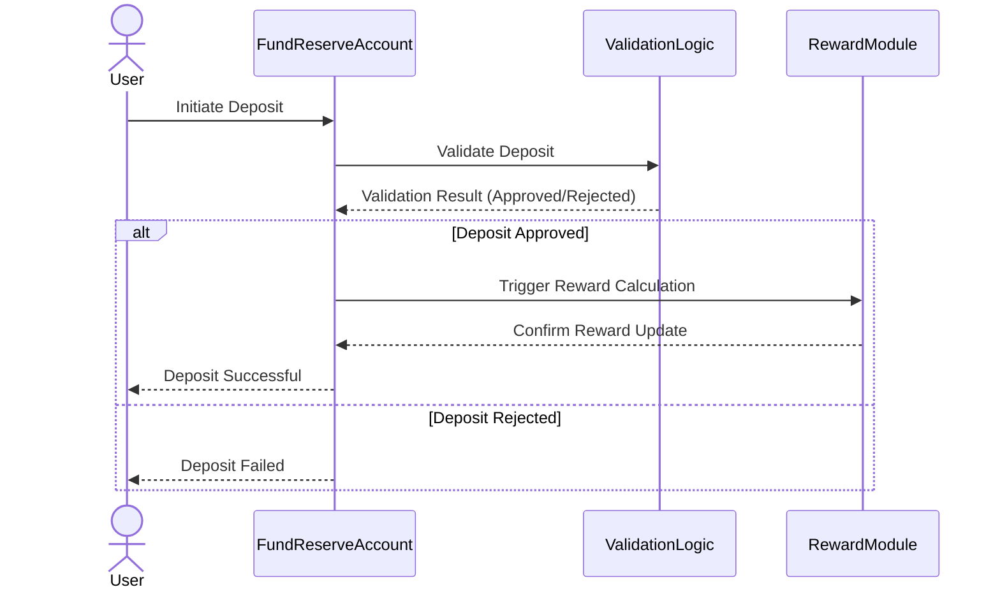

## **Asset Deposits**

### **Supported Assets and Validation Rules**

The Fund module specifies the assets that users can deposit, verifying eligibility, validating transaction authenticity, and ensuring that only supported tokens are accepted into the Fund reserve.

Upon user deposit initiation, assets are securely transferred to the fund reserve account. The module validates and confirms the transfer, updates internal records on-chain, and subsequently triggers the reward-tracking mechanisms integrated within FRAG-22.

