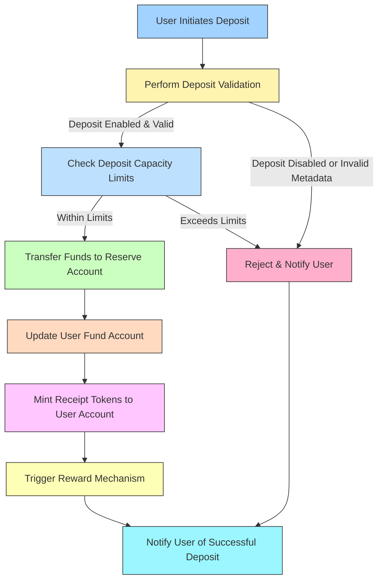

## Deposit

The Fund Module precisely handles user deposits through systematic validation and processing procedures. This section provides a detailed description of deposit management, illustrating clear interactions and structures directly derived from the existing FRAG-22 implementation logic.

## Structure of the Fund Module in Deposit Context

## Detailed Deposit Procedure

Below is the precise breakdown of the deposit procedure, derived directly from the FRAG-22 implementation logic, ensuring full transparency and correctness.

### **Step 1: Deposit Initiation**

**User Action:**

- User specifies the asset type (e.g., SOL or supported SPL tokens) and amount to deposit.

**Fund Module Action:**

- Immediately initiates a validation process.

### **Step 2: Validation of Deposit Request**

**Validation Procedure:**

- Verify if the deposit functionality for the chosen asset is currently enabled.
- Confirm that the deposit amount does not exceed the deposit capacity limits defined in the Fund module.
- Check if the provided metadata (if any) related to the deposit is valid and correctly signed.
- Ensure that deposit operations comply with the Fund’s configured rules (deposit enabled flag, capacity limits, and other protocol-specific constraints).

**Outcome:**

- **Valid Request:** Move forward to fund transfer.
- **Invalid Request:** Reject and notify the user immediately, detailing the reason (e.g., capacity exceeded, invalid metadata signature, deposit functionality temporarily disabled).

### **Step 3: Fund Transfer to Reserve**

**Fund Reserve Account:**

- Upon successful validation, the user’s funds are securely transferred directly to the Fund Reserve Account.
- The Fund Reserve Account serves as the primary custody account, holding all deposited assets securely and transparently.

### **Step 4: User Account Updates & Receipt Tokens**

**User Fund Account:**

- The user’s individual Fund Account is updated to accurately reflect the deposited assets, maintaining a precise record of each user’s cumulative contributions.
- This user-specific tracking ensures clear auditability and correct calculation of user shares and balances.

**User Receipt Token Account:**

- Corresponding receipt tokens are minted and credited to the user’s Receipt Token Account, representing their share of assets within the Fund.
- Receipt tokens serve as the claim mechanism for deposited assets and subsequent yield distribution, enabling transparent accounting and asset redemption.

### **Step 5: Reward Mechanism Trigger**

**Reward Account:**

- After successfully minting receipt tokens, the Reward Account mechanism is triggered.
- Rewards begin accruing for the user based on their deposited amount and the timing of their deposit.
- Reward calculations consider proportional contributions, ensuring precise and fair distribution.

## **Deposit Information Recorded in User Fund Account:**

- **User ID**
- **Asset Type (e.g., SOL, SPL tokens)**
- **Deposited Amount**
- **Timestamp of Deposit**
- **Associated Receipt Token Amount**

## **Post-Deposit Asset Management**

- Deposited assets held within the Fund Reserve Account are strategically allocated, either maintained in liquidity reserves to facilitate rapid withdrawals or deployed to various Yield Sources to generate additional returns.
- The allocation strategy is dynamically managed by operational roles defined within the Fund module, balancing immediate liquidity requirements against long-term capital efficiency.

## **Deposit Processing Timeline**

- **Immediate Validation:** Executed instantly upon user action.
- **Fund Transfer:** Typically instantaneous, barring network latency.
- **Receipt Token Minting & User Update:** Immediate after fund custody.
- **Reward Triggering:** Immediate post token minting.