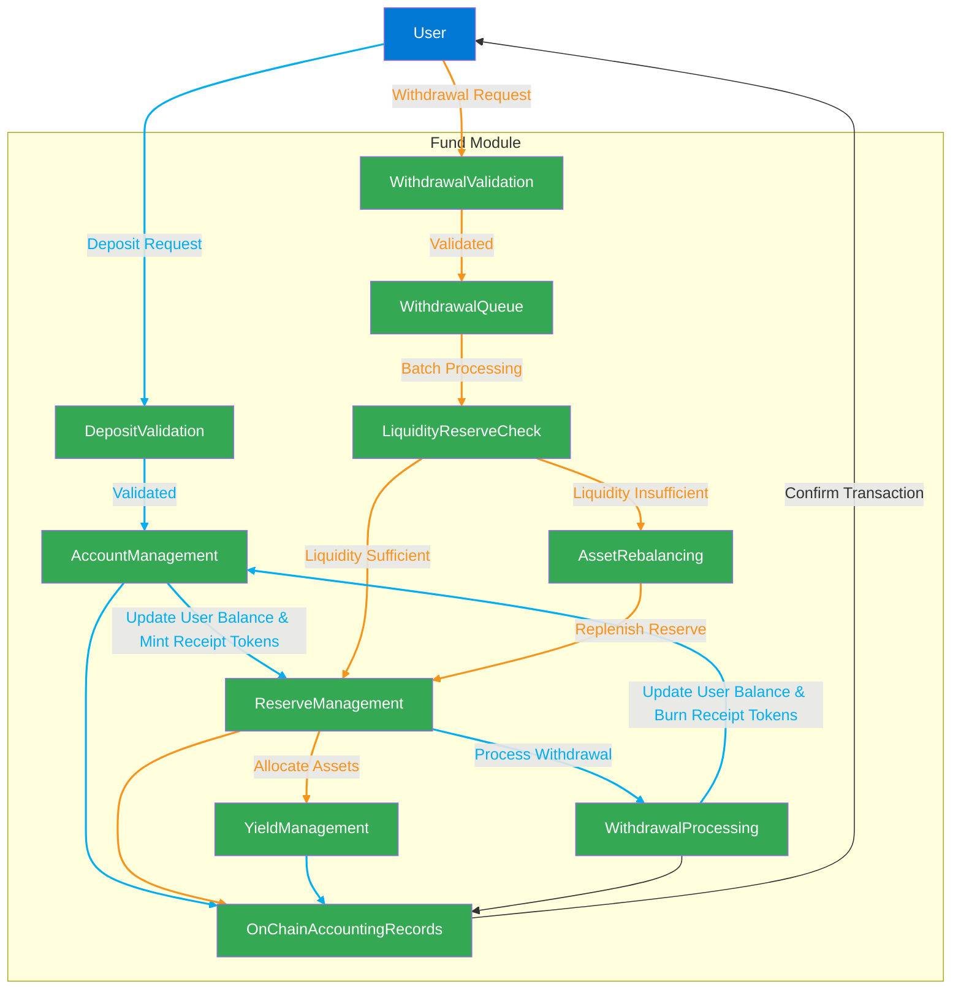

## **FRAG-22 : Fund Module**

### **Overview**

The Fund module serves as the core liquidity management, and accounting engine within the FRAG-22 ecosystem. It securely manages user deposits and withdrawals, maintains precise onchain records, and ensures liquidity efficiency. By providing robust fund management and transparent accounting, it lays the foundation for secure and efficient decentralized asset management.

