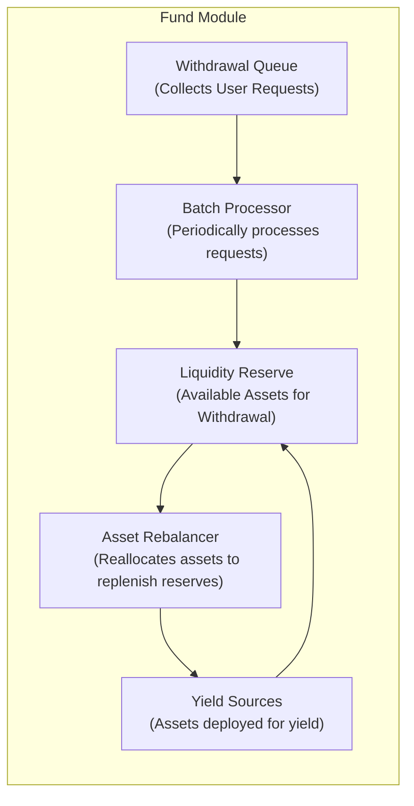
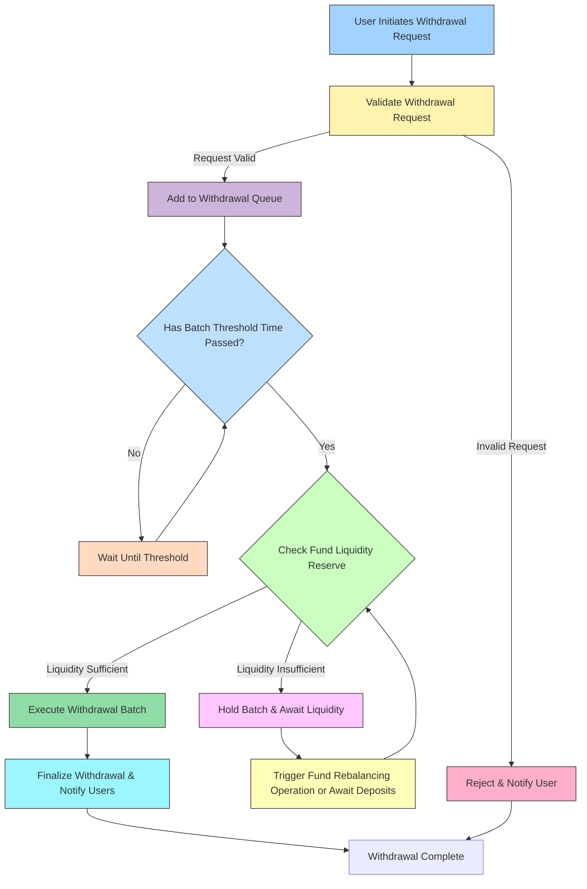
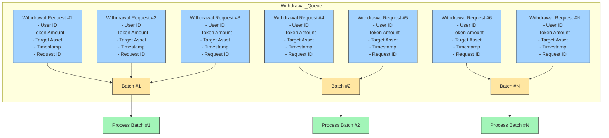

## **Structure of the Fund Module in Withdrawal Context**

**Withdrawal Queue:**

- A dedicated system that temporarily stores all user withdrawal requests.
- Each request includes:
  - User ID
  - Requested amount and asset type
  - Timestamp and status

**Withdrawal Batches:**

- Periodically processed groups of queued withdrawal requests.
- Requests are not immediately settled but grouped and processed at scheduled intervals to maintain liquidity stability and minimize transaction fees.

**Liquidity Reserve:**

- A pool of readily available assets maintained within the Fund to quickly fulfill withdrawal requests.
- Sized strategically—large enough for average withdrawal demand but not excessive to avoid inefficient capital allocation.

**Yield Sources:**

- Investment strategies where Fund assets are allocated to generate additional returns (e.g., liquidity pools, lending markets).
- These sources provide returns but may have varying liquidity and withdrawal timeframes, influencing withdrawal speed.

## **Detailed Withdrawal Procedure**

This section describes the detailed step-by-step procedure of withdrawal management within the architecture context, aiding developers and stakeholders in clearly understanding system behaviors before examining the underlying implementation.

**Step 1: Withdrawal Request Initiation**

- **User Action:**
  - The user initiates a withdrawal request specifying the asset and the amount desired.
- **Fund Module Action:**
  - Immediately validates the user’s current asset balance.
  - Upon successful validation, logs the request in the **Withdrawal Queue** with a timestamp, user identifier, asset type, and amount.
  - Confirms the queuing status back to the user.

**Step 2: Withdrawal Queue and Batch Formation**

- **Accumulation:**
  - Withdrawal requests accumulate within the Withdrawal Queue until reaching predefined processing criteria:
    - Scheduled time intervals (e.g., daily batches).
    - Accumulated request thresholds (total requested amounts).
- **Batch Creation:**

- At the trigger point, accumulated requests are grouped into a **Withdrawal Batch**.
- Batch maintains requests’ original submission order (FIFO – first-in-first-out).

**Step 3: Liquidity Reserve Verification**

- **Liquidity Assessment:**
  - The Fund Module assesses available liquidity in the internal reserve.
  - Decision points based on reserve evaluation:
    - **Immediate Settlement:** Reserve assets are sufficient; funds are disbursed immediately.
    - **Rebalancing Required:** Insufficient reserve liquidity; additional processes are triggered.
- **Batch Status Update:**
  - Updates each request in the batch, marking them either “ready for immediate settlement” or “pending due to rebalancing.”

**Step 4: Asset Rebalancing Procedure (if required)**

- **Asset Retrieval from Yield Sources:**
  - Initiates withdrawals from external yield sources, prioritized by liquidity availability (shortest withdrawal periods first).
- **Prioritized Fulfillment:**
  - Withdrawal requests delayed due to liquidity constraints are prioritized by timestamp within their batch.
- **Continuous Updates:**
  - Users are notified regularly about estimated fulfillment timelines and any delays incurred due to asset rebalancing.

**Step 5: Final Batch Settlement**

- **Withdrawal Fulfillment:**
  - Upon successful rebalancing, the liquidity reserve is replenished.
  - Requests marked as pending are processed sequentially according to their original queue order.
- **Settlement Confirmation:**
  - Funds are transferred to user accounts.
  - Batch status is updated to “completed,” closing the batch processing cycle.
- **User Notification:**
  - Confirmation of successful withdrawal is sent to users.

### **Withdrawal Timing Variations**

Withdrawal processing times can vary based on liquidity status:

- **Immediate Liquidity (Fastest):**
  - Processed quickly at scheduled batch intervals (minutes to hours).
- **Short-Term Rebalancing (Moderate Delay):**
  - Minor liquidity constraints resolved within hours to days through high-liquidity yield sources.
- **Long-Term Rebalancing (Extended Delay):**
  - Major liquidity constraints require withdrawal from longer lockup yield sources, potentially delaying settlement from days to weeks.