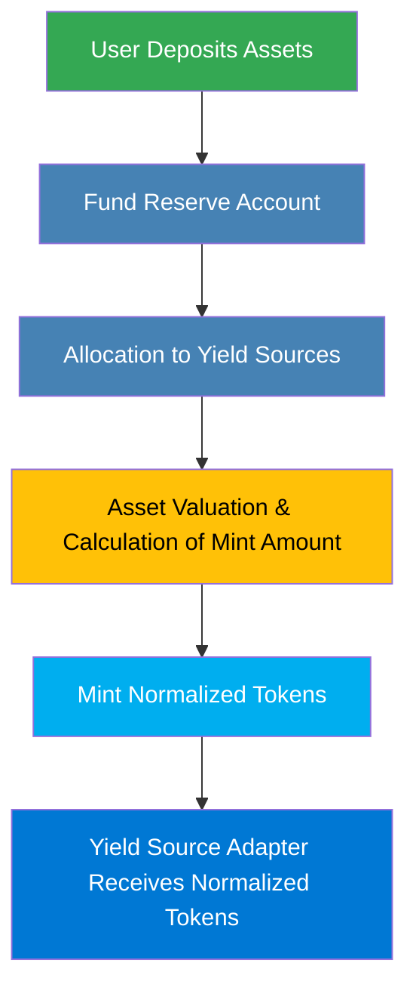
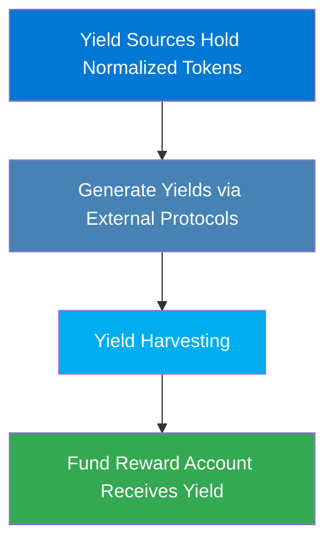
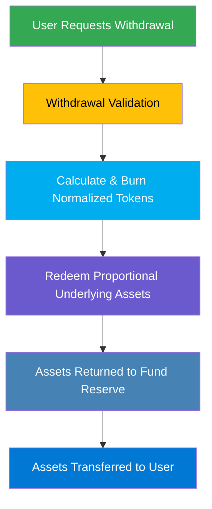
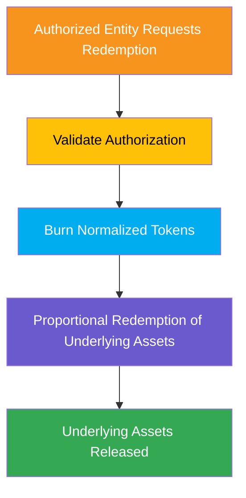
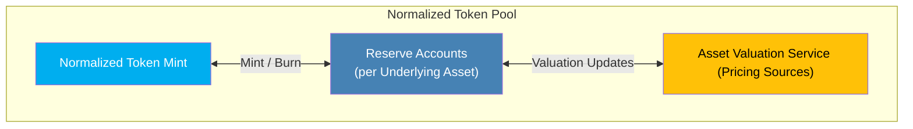

A **Normalized Token** is a unified representation of multiple assets pooled together within FRAG-22. Instead of managing multiple assets separately, yield sources hold normalized tokens, which dynamically adjust their value according to the real-time valuations of the underlying assets. Normalized tokens are exclusively managed by yield source adapters or special authorized entities (e.g., slashers), maintaining controlled, secure operations.

## **Key Features of Normalized Tokens**

- **Dynamic Valuation:**

  Continuously reflects changes in underlying asset values.
- **Simplified Asset Handling:**

  Yield sources interact only with normalized tokens, reducing complexity.
- **Controlled Access:**

  Exclusively accessible to authorized entities (yield sources, slashing modules).
- **Proportional Redemption:**

  Redeemable into underlying assets proportionally, ensuring fairness.

## **User Actions & Token Lifecycle**

### **Asset Allocation & Normalized Token Minting**

**User deposits assets → FRAG-22 allocates to Yield Sources → Mint normalized tokens.**

#### **Process :**

- Users deposit underlying assets into the Fund Reserve.
- The reserve allocates these assets to selected yield sources.
- The system calculates the minting amount based on current asset valuations (maintaining 1:1 value at the initial minting, dynamically adjusted later).
- Corresponding normalized tokens are minted and issued to yield source adapters.

### **Yield Source Interaction & Yield Management**

**Yield Sources manage normalized tokens → Generate yield → Harvest & return rewards**

#### **Process :**

- Yield sources hold normalized tokens representing pooled assets.
- Assets generate yield through external DeFi protocols.
- Yield sources harvest the accumulated yield regularly.
- Harvested yields are transferred back to the Fund Reward Account, contributing to the overall reward pool.

### **Redemption & Withdrawal of Underlying Assets** 

#### **User-Initiated Withdrawal (Standard Case)**

**User requests withdrawal → Burn normalized tokens → Underlying assets returned**

#### **Process :**

- Users initiate withdrawal requests.
- The system validates the request and determines how many normalized tokens must be burned based on current valuations.
- Corresponding underlying assets are proportionally redeemed and returned to the Fund Reserve.
- The user receives the redeemed underlying assets.

#### **Special Authorized Redemption (e.g., Slashing)**

**Authorized entity holds normalized tokens → Redeem underlying assets**

#### **Process :**

- Special entities (such as slashers) holding normalized tokens can redeem underlying assets.
- Authorization and token ownership are validated.
- The normalized tokens are burned, and underlying assets proportionally redeemed.
- Assets are immediately released, ensuring rapid, secure operations.

## **Exchange Ratios & Pricing Mechanism**

Normalized token exchange ratios dynamically depend on:

- **Total Normalized Token Supply:**

  Reflects collective user positions in the pool.
- **Underlying Assets Value:**

  Determined by real-time asset valuations using integrated pricing sources.
- **Proportional Distribution:**

  Underlying assets are redeemed proportionally based on current locked asset valuations within the pool, maintaining fairness and transparency.

## **Normalized Token Pool Structure Diagram**

- **Normalized Token Mint:** Manages the minting and burning processes.
- **Token Reserve Accounts:** Store underlying assets individually.
- **Asset Valuation Service:** Provides dynamic pricing to ensure accurate valuation of underlying assets.

## **Importance of Normalized Tokens**

- **Unified Representation:**

  Enables simplified management of multiple diverse assets through a single token interface.
- **Accurate Valuation:**

  Continuously ensures fairness by reflecting real-time asset values.
- **Efficiency & Scalability:**

  Reduces operational overhead and facilitates scalable yield management.
- **Security & Control:**

  Restricts access to yield sources or authorized entities, ensuring the system’s security and integrity.