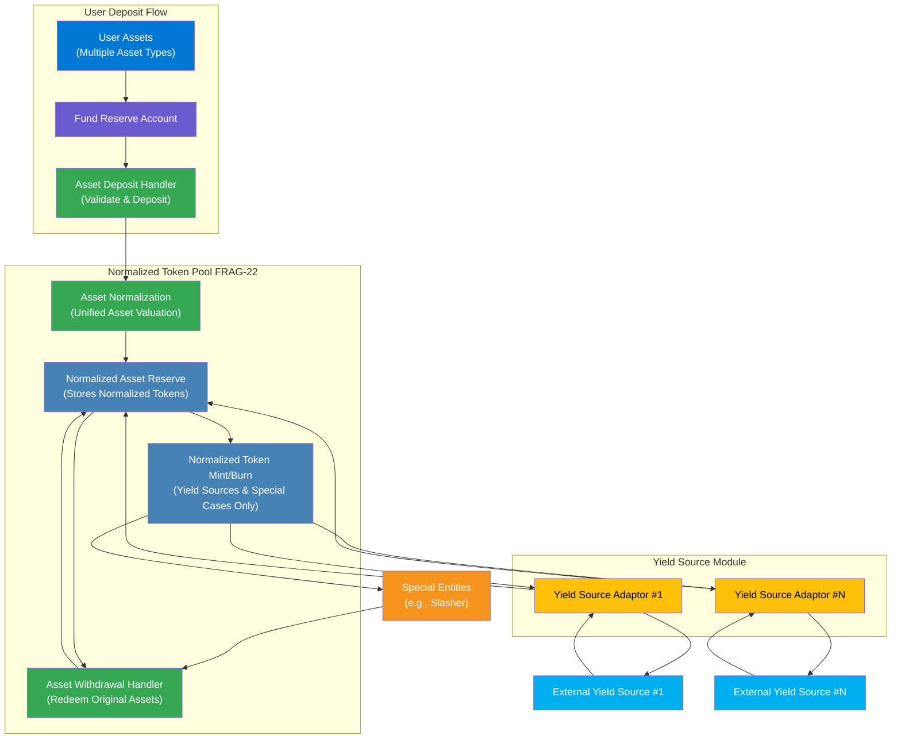

The **Normalized Token Pool** within the FRAG-22 ecosystem serves as an essential mechanism for efficiently handling multiple asset types in a unified, composable manner. By standardizing different types of deposited tokens into a single, fungible token representation, it significantly simplifies asset management, enhances liquidity efficiency, and optimizes capital utilization across the protocol.

At its core, the Normalized Token Pool aggregates diverse underlying assets deposited by users, assigning normalized values to maintain fair proportionality. This approach ensures seamless integration with various yield strategies, liquidity provisions, and DeFi applications, effectively removing complexity from multi-asset management.

### **Key Functionalities:**

- **Asset Normalization:**

  Translates deposited assets into a common token representation, ensuring consistency in valuation and reward calculation.
- **Liquidity Optimization:**

  Pools normalized assets to maximize efficiency, enabling simpler and faster reallocation of assets to yield-generating sources.
- **Simplified Asset Management:**

  Reduces operational overhead for users and developers by abstracting away complexities associated with handling multiple distinct asset types.
- **Composability and Interoperability:**

  Facilitates effortless integration with external DeFi applications, enabling users to leverage their normalized asset positions across diverse financial protocols seamlessly.

### **Structural Diagram:**

The Normalized Token Pool thus forms a robust foundation within FRAG-22, enabling highly efficient, scalable, and simplified asset interactions across decentralized finance.