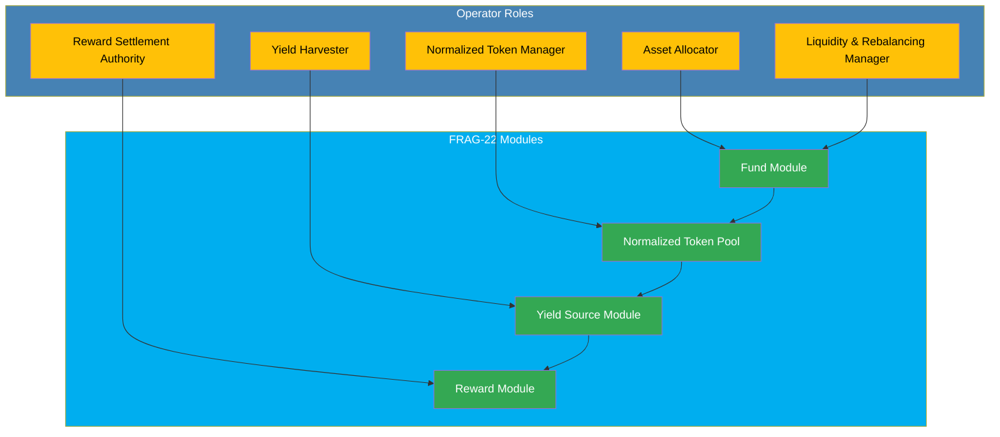

## Overview

In the FRAG-22 ecosystem, **Operators** are specialized roles responsible for critical operational tasks, ensuring the seamless execution, maintenance, and optimization of the entire system. Operators handle asset allocation, yield management, reward settlements, and various operational tasks within predefined permission structures, safeguarding both security and efficiency.

## Core Responsibilities of Operators

- **Asset Allocation Management**: Strategically manage the allocation of pooled assets across multiple yield sources, maximizing returns and optimizing asset utilization.

- **Yield Harvesting & Reward Management**: Periodically harvest yields generated by external yield sources, managing rewards securely and transparently within the Fund Reward Accounts.

- **Reward Settlement**: Conduct regular settlement procedures, accurately distributing rewards to user accounts based on their recorded contributions.

- **Normalized Token Management**: Oversee minting, burning, and redemption operations involving normalized tokens, ensuring accurate valuations and fairness across user interactions.

- **Liquidity & Asset Rebalancing**: Maintain optimal liquidity levels within the Fund Module, promptly responding to withdrawal demands and market conditions.

- **Operational Security & Compliance**: Maintain adherence to defined protocols, ensuring transactions, asset management, and settlements are compliant with established security standards.

## Operator Interaction within FRAG-22

Operators interact closely with multiple modules, including Fund, Reward, Yield Source, and Normalized Token Pool. Their coordinated efforts enable FRAG-22 to deliver predictable, secure, and efficient financial services within the decentralized ecosystem.

## Permissions and Access Control

Operator permissions are explicitly defined and strictly enforced:

- **Allocation Authority**: Authorized to define asset allocation ratios.
- **Settlement Authority**: Authorized to initiate reward settlements.
- **Harvesting Authority**: Responsible for yield collection from external sources.
- **Mint & Burn Authority**: Controls minting and burning of normalized tokens based on system requirements.

These permissions ensure clarity, accountability, and the highest level of security in all operator-driven tasks.

## Importance of Operators in FRAG-22

Operators are crucial for the effective, secure, and efficient management of assets and yields. They ensure the FRAG-22 system remains responsive and robust, continuously optimizing performance while maintaining operational integrity.

Their clearly defined roles and restricted permissions create a balanced operational environment, essential for maintaining user trust and system reliability.
