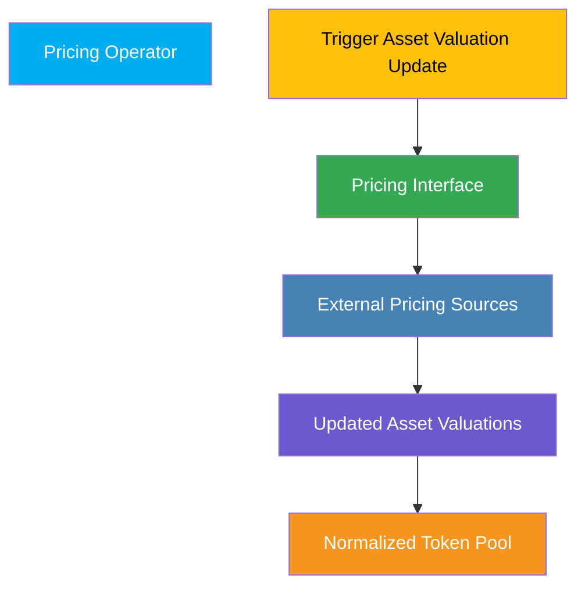
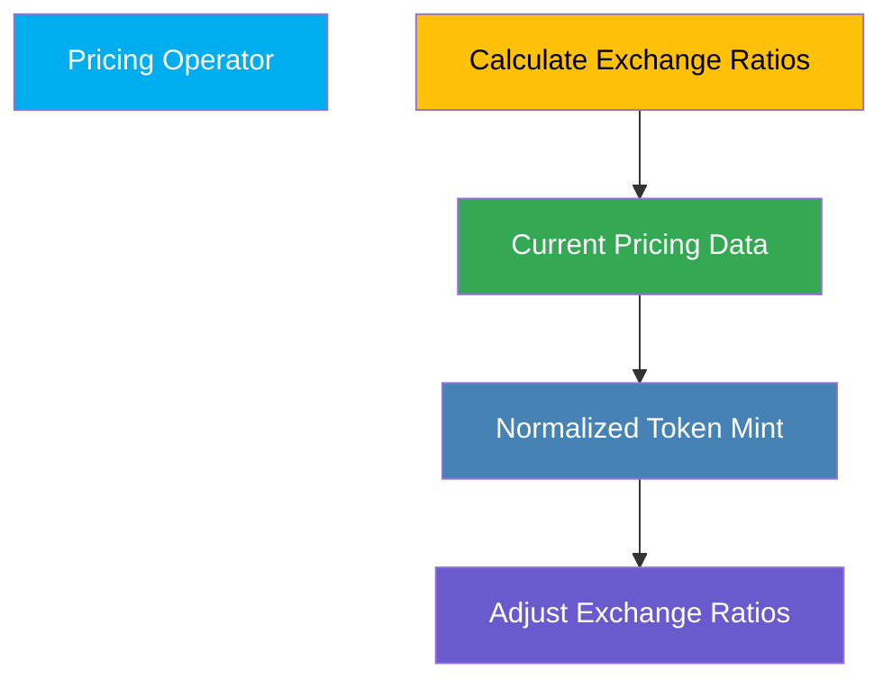
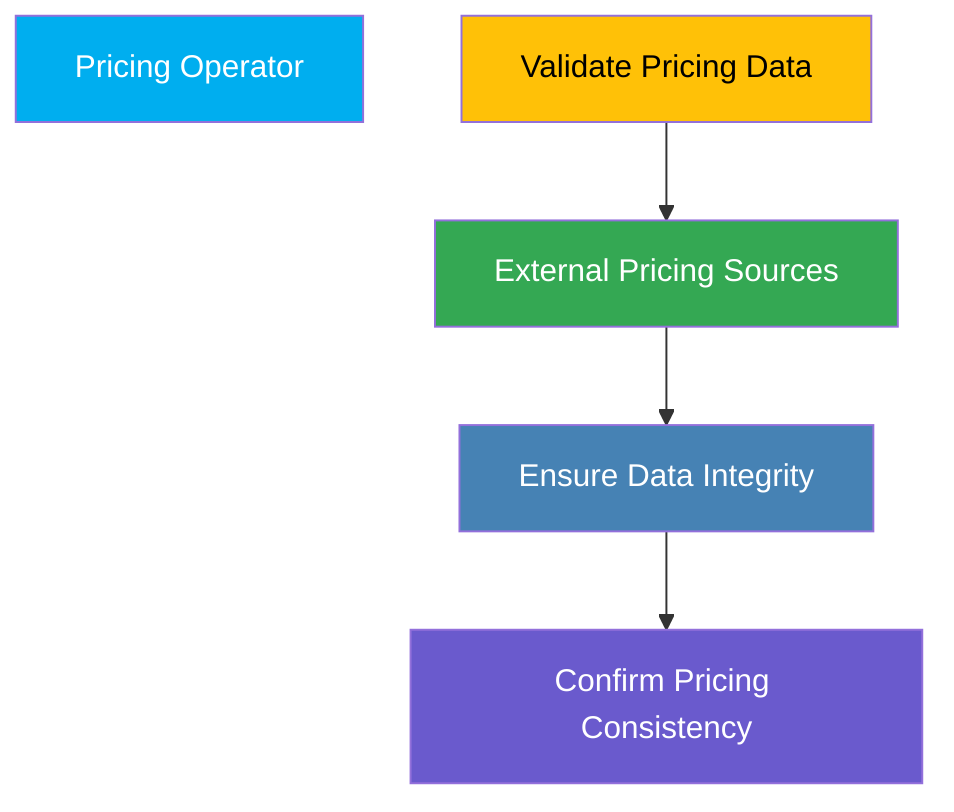

## Overview

The **Pricing Operator** plays a critical role in the FRAG-22 ecosystem by ensuring accurate, reliable, and timely updates of asset valuations. Accurate pricing directly impacts normalized token valuation, redemption fairness, and overall asset management within the system.

## Responsibilities and Operations

### 1. Asset Valuation Updates

The Pricing Operator periodically updates the valuation of underlying assets within the Normalized Token Pool using integrated pricing sources.

**Core Functions:**

- **Trigger Valuation Updates:** Regularly initiate asset valuation procedures.
- **Integrate Pricing Sources:** Use predefined external pricing sources to ensure precise asset valuations.

**Process Overview:**

### 2. Maintaining Exchange Ratios

The Pricing Operator maintains accurate exchange ratios between normalized tokens and underlying assets, ensuring fair and transparent redemption processes.

**Core Functions:**

- **Calculate Exchange Ratios:** Dynamically calculate normalized token valuations based on the updated asset prices.
- **Adjust Valuations:** Continuously monitor and adjust valuations to reflect market conditions accurately.

**Process Overview:**

### 3. Pricing Data Integrity

Ensures data integrity and consistency across the FRAG-22 system by verifying and validating pricing sources regularly.

**Core Functions:**

- **Data Verification:** Regularly verify pricing data from multiple integrated sources.
- **Ensure Consistency:** Maintain consistency and transparency in reported valuations.

**Process Overview:**

## Permissions and Access

Pricing Operators have the following clearly defined authorities:

- **Valuation Update Authority**:

  - Explicitly authorized to initiate asset valuation updates via integrated pricing sources.

- **Implicit Exchange Ratio Adjustment**:
  - Indirectly influences exchange ratios by updating underlying asset valuations. Exchange ratio adjustments are automatically computed by the system.

**Note:** Pricing data integrity checks are automatically managed by the system internally and do not require explicit operator oversight.

## Importance in FRAG-22

The Pricing Operator ensures critical valuation accuracy, directly influencing normalized token fairness, reward calculations, and system trustworthiness, which are essential to the reliability and overall success of the FRAG-22 ecosystem.
