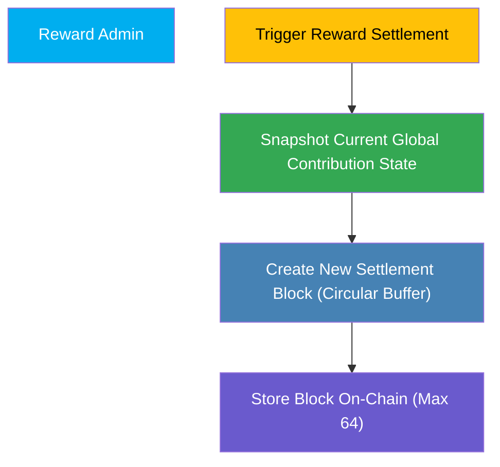
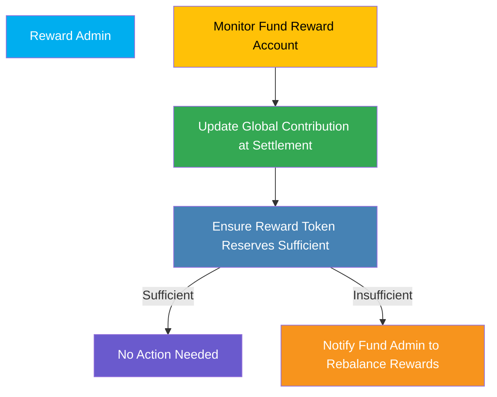

The **Reward Admin** ensures accurate and timely distribution of accumulated rewards within the FRAG-22 ecosystem. This role triggers periodic settlements, manages on-chain reward settlement blocks, and maintains the integrity of the reward pools, directly aligning with the implemented system logic.

## Responsibilities and Operations

### 1. Reward Settlement Management

The Reward Admin periodically initiates reward settlement procedures, recording global reward pool states into on-chain settlement blocks, but does **not directly calculate individual user rewards**. Users calculate and claim their individual rewards separately.

**Core Functions:**

- **Trigger Settlements:** Periodically initiate the settlement process, creating a new settlement block that snapshots the current global contribution state.
- **Settlement Block Management:** Maintain up to 64 on-chain settlement blocks in a circular buffer, ensuring historical data availability for reward claims.

**Process Overview:**

### 2. Reward Pool Maintenance

The Reward Admin oversees the Fund Reward Accounts, ensuring these accounts correctly track global contributions and accumulated rewards.

**Core Functions:**

- **Monitor Global Contribution:** Ensure accurate tracking and updates of global contribution states within Fund Reward Accounts upon each settlement.
- **Reward Reserve Oversight:** Confirm reward tokens are sufficiently reserved, maintaining the integrity and readiness of reward pools for claims.

**Process Overview:**

## Permissions and Access

Reward Admins have:

- **Settlement Trigger Authority:** Authorized to initiate periodic settlements, creating on-chain snapshots (settlement blocks).
- **Fund Reward Account Oversight:** Permissions to monitor global contribution states and reward reserves but not individual user-level distributions directly.

These clear permissions maintain operational integrity and security.

## Importance in FRAG-22

Reward Admins are essential for maintaining the fairness and transparency of the reward distribution system, enabling reliable and secure operation for users.
