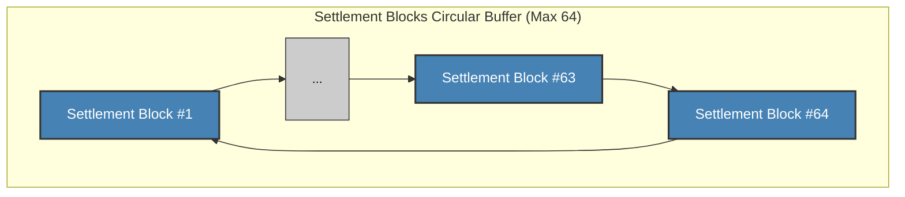
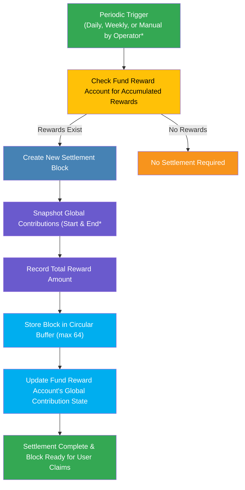
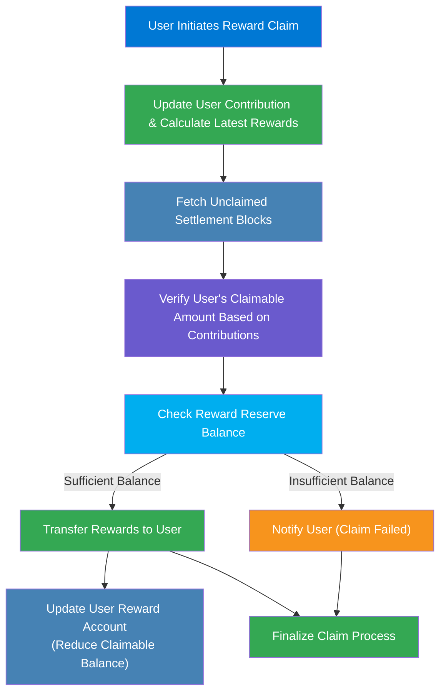

In the FRAG-22 architecture, rewards are distributed based on each user’s contribution—determined by the amount of tokens held and the duration these tokens are held. The processes of **Settlement** and **Claiming** manage accurate reward distribution, ensuring fairness and precision.

## **Settlement in FRAG-22**

Settlement is a periodic process where newly accumulated rewards in the Fund Reward Account are proportionally allocated to all contributors based on their accumulated contribution points during a defined time interval. Each settlement results in a **Settlement Block**, which records the reward details, enabling users to claim rewards later.

**Why Settle?**

- Ensures rewards are fairly allocated according to token holding duration and amount.
- Provides transparency and auditability.
- Maintains manageable on-chain storage for reward data.

## **Detailed Structure of a Settlement Block**

Each settlement generates a **Settlement Block**, structured with the following key data:

- **Reward Amount**: Total amount of reward tokens to distribute in the settlement period.
- **Start and End Contribution Snapshot**: Captures global contributions at the beginning and end of the settlement period, defining the exact interval.
- **Timestamp**: Time when the settlement block was created.

These settlement blocks are stored in a **circular buffer** with a fixed length of **64**, meaning the system retains only the **64 most recent settlement records**. When a new block is created beyond this limit, it overwrites the oldest block.

### **Settlement Block Buffer Structure**

- **Note**: Due to this circular nature, users must claim their rewards regularly to avoid losing access to older rewards.

Due to the fixed storage size (64 settlement blocks), managing settlement blocks efficiently is critical:

- **Resource Optimization**: Keeps on-chain storage efficient and cost-effective.
- **Fairness and Incentivization**: Encourages users to claim rewards regularly, optimizing reward distribution fairness and system usage.

### **Settlement Block Management**

- Settlement blocks are managed as a circular buffer (FIFO - First In, First Out).
- Oldest settlement blocks are overwritten by the newest ones after exceeding 64 settlements.
- Users who fail to claim rewards within 64 blocks (e.g., 64 days, if settlements are daily) permanently lose access to those rewards. These lost rewards typically revert to the treasury.

## **Reward Settlement Procedure**

- **Periodic Execution**: Ensures predictable intervals of reward calculation and distribution.
- **Accurate Calculation**: Rewards precisely allocated proportional to recorded global contributions.
- **Structured Storage**: Efficiently maintains only the most recent 64 settlements.

## **Reward Claim**

Users individually initiate reward claims. Claims are calculated based on accumulated contributions and stored settlement data:

- **Contribution Update**: Before claiming, user-specific contributions are updated based on the latest holding period.
- **Fetch Unclaimed Rewards**: User’s reward claims are calculated using historical settlement blocks not yet claimed.
- **Reserve Check**: Ensures the system has sufficient liquidity to honor claims.
- **Token Transfer**: Successful claims result in immediate reward token transfers to the user’s wallet, and claimable balances are updated accordingly.

## **User Implications**

- **Regular Claims Recommended**: Users should periodically claim their accumulated rewards to prevent losing older rewards due to block overwriting.
- **Transparency**: Users can always verify current and historical contributions and claimable rewards, ensuring complete transparency.