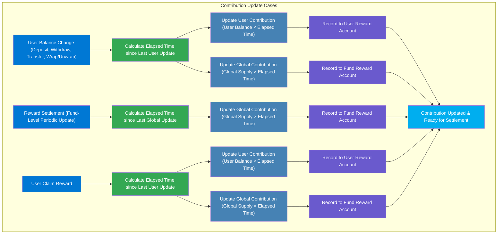
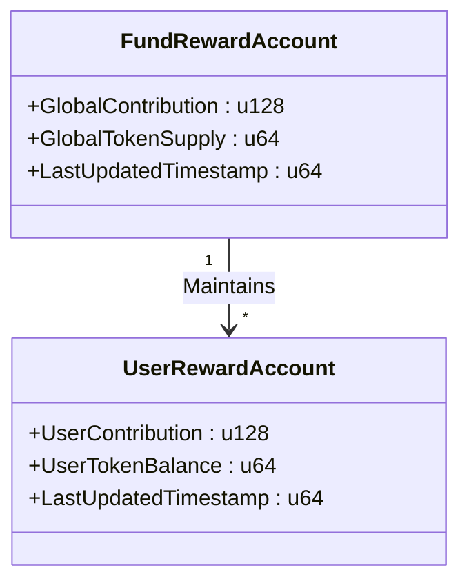

### **Contribution Tracking**

In the FRAG-22 standard, reward distribution isn’t simply based on the current balance of receipt tokens held by users. Instead, rewards reflect both **the quantity of tokens and the duration they are held**. Accurately tracking this combination of quantity and time—termed **“Contribution”**—ensures rewards are distributed fairly according to users’ actual involvement over time.

When a user’s token balance changes, either by deposit, withdrawal, transfer, or wrapping/unwrapping, the system immediately recalculates their contribution to keep reward allocations precise and fair.

### **Contribution  Calculation**

Contribution calculation involves two primary data structures:

- **Fund Reward Account**: Maintains global information about total token supply and cumulative contributions across all users.
- **User Reward Account**: Tracks each user’s token balance, individual contribution, and the timestamp of their last contribution update.

**The formula for calculating contribution is:**

$\text{Contribution Increase} = \text{Token Balance at Previous Update} \times \text{Elapsed Time}$

Upon any balance change, FRAG-22 performs two calculations:

1. **Global Contribution Update**
   - Calculates the elapsed time since the last global update.
   - Increases global contribution by multiplying global token supply with the elapsed time.
2. **User Contribution Update**
   - Calculates the elapsed time since the user’s last update.
   - Increases user’s contribution by multiplying user’s token balance with the elapsed time.

This immediate recalculation ensures both global and individual contribution records stay accurate.

### **Contribution Calculation Flow**

### **Data Structure of Contribution Records**

**Explanation:**

- **Fund Reward Account**
  - **GlobalContribution**: Cumulative contribution of all users.
  - **GlobalTokenSupply**: Total outstanding token supply at the last update.
  - **LastUpdatedTimestamp**: Timestamp of the last global contribution update.
- **User Reward Account**
  - **UserContribution**: User’s accumulated contribution over time.
  - **UserTokenBalance**: User’s token balance at the last update.
  - **LastUpdatedTimestamp**: Timestamp of the last individual update.

This structure enables immediate updates on contribution states, facilitating accurate reward calculation and settlement.

### **Contribution Tracking Example**

To clearly illustrate contribution calculations, consider three users—**Alice**, **Bob**, and **Chuck**—and how their contributions evolve:

| **Time (seconds)** | **Alice’s Tokens** | **Bob’s Tokens** | **Chuck’s Tokens** | **Total Token Supply** | **Alice’s Contribution** | **Bob’s Contribution** | **Chuck’s Contribution** | **Global Contribution** |
| :----------------- | :----------------- | :--------------- | :----------------- | :--------------------- | :----------------------- | :--------------------- | :----------------------- | :---------------------- |
| 0                  | 500                | 300              | 200                | 1000                   | 0                        | 0                      | 0                        | 0                       |
| 300                | 800 (\+300)        | 300              | 400 (\+200)        | 1500 (\+500)           | 150,000                  | 90,000                 | 60,000                   | 300,000                 |
| 480                | 600 (-200)         | 500 (\+200)      | 400                | 1500                   | 294,000                  | 144,000                | 132,000                  | 570,000                 |
| 600                | 600                | 500              | 400                | 1500                   | 366,000                  | 204,000                | 180,000                  | 750,000                 |

**How to read this table:**

- From 0 to 300 seconds:
  - Alice held 500 tokens for 300 seconds:

    **Alice’s contribution increase**: $500 \times 300 = 150,000$
  - Total global tokens were 1000 for 300 seconds:

    **Global contribution increase**: $1000 \times 300 = 300,000$
- Similarly, contributions for Bob and Chuck are calculated at each interval.

### **Contribution Tracking Outcomes**

By employing immediate recalculation upon every balance change:

- **Fairness**: Ensures that rewards match user participation accurately.
- **Transparency**: Users can verify their contributions and corresponding rewards clearly.
- **Precision**: Facilitates precise and trustworthy reward distribution aligned to actual token holding duration.

FRAG-22’s structured approach provides a transparent, verifiable, and accurate reward distribution mechanism by effectively managing user contributions in real-time.