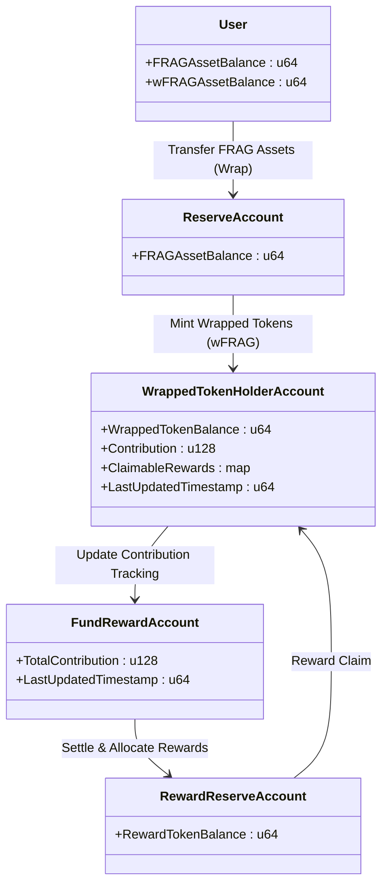
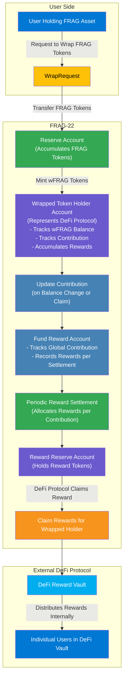

To integrate FRAG-22 with external DeFi protocols, users must first **wrap** their FRAG-22 receipt tokens into wrapped tokens (**wFRAG** assets). The wrapping process transfers original FRAG assets into the Fund’s reserve account, minting corresponding SPL-compliant wrapped tokens to represent those original assets within external DeFi protocols.

These wrapped tokens held by external DeFi vaults accumulate their own contributions within FRAG-22’s reward tracking system. Since the FRAG-22 module cannot directly monitor individual user actions inside external DeFi protocols, the wrapped tokens’ accumulated rewards are distributed to the corresponding DeFi vaults. These external DeFi vaults then internally distribute the rewards to their own participants.

## **Technical Process**

### **Wrapping Procedure (User → DeFi Vault)**

**Process**:

- **User Action**:

  User initiates the wrapping of their FRAG-22 receipt tokens.
- **FRAG-22 Action**:
  - Transfers user’s original FRAG-22 tokens to the Fund’s **Reserve Account**.
  - Mints an equal amount of SPL-compliant wrapped tokens (e.g., **wFRAG**) and sends them to the user’s account.
  - Updates the **Wrapped Token Holder Account** to reflect the increase in the wrapped token balance.

**Consequence**:

- Wrapped tokens become representative assets in external DeFi protocols.
- Contribution for rewards now begins tracking in the **Wrapped Token Holder Account**.

### **Wrapped Asset and Contribution Structure**

**Data Structures involved**:



### **Reward Accumulation & Tracking (Fund → Wrapped Token Holder)** 

- **FRAG-22 Reward Accumulation**:
  - Rewards from various yield sources accumulate within the **Fund Reward Account** periodically (daily, weekly, etc.).
  - Contribution of wrapped token holders (**DeFi Vaults**) is tracked similarly to individual users but at the vault level.
- **Wrapped Token Holder Contribution**:

  Wrapped Token Holder contribution is continuously updated based on:

```
Wrapped Holder Contribution Increment = Wrapped Token Balance × Elapsed Time
```

- **Outcome**:

  Accurately accumulated reward pools allocated specifically for DeFi vault participants.

### **Reward Claim Procedure by External DeFi Protocols** 

Because the FRAG-22 system cannot track individual users within external protocols, rewards accumulated by Wrapped Token Holders (representing DeFi vaults) are claimed directly by those DeFi protocols:

**Detailed Claiming Procedure**:

- **Initiate Claim**:

  DeFi protocol (owner of the Wrapped Token Holder account) initiates the reward claim via FRAG-22.
- **FRAG-22 Actions**:
  1. Updates the Wrapped Token Holder’s contribution state to reflect the latest status.
  2. Calculates proportional rewards accumulated across available settlement blocks (max 64).
  3. Transfers the calculated reward amount from the Reward Token Reserve Account to the external DeFi vault’s reward distribution account.
- **Outcome**:

  DeFi protocol receives rewards directly and can now internally distribute these rewards among its participants based on their proportional holdings within the DeFi vault.

### **Internal Reward Distribution by External DeFi Protocols**

After receiving rewards, external DeFi vaults distribute the rewards internally to their users through their native reward mechanisms. This step is independent of FRAG-22 and entirely handled by the DeFi protocols themselves.

## **Comprehensive Flow Diagram**



## **Why this Approach?**

- **Fairness**: Users participating in external DeFi protocols through wrapped FRAG assets still earn rewards proportional to their underlying FRAG asset holdings.
- **Scalability**: Allows easy integration with multiple DeFi protocols without adding complexity to individual user tracking.
- **Transparency**: All reward flows remain clear, auditable, and on-chain, up to the point of distribution to external DeFi protocols.