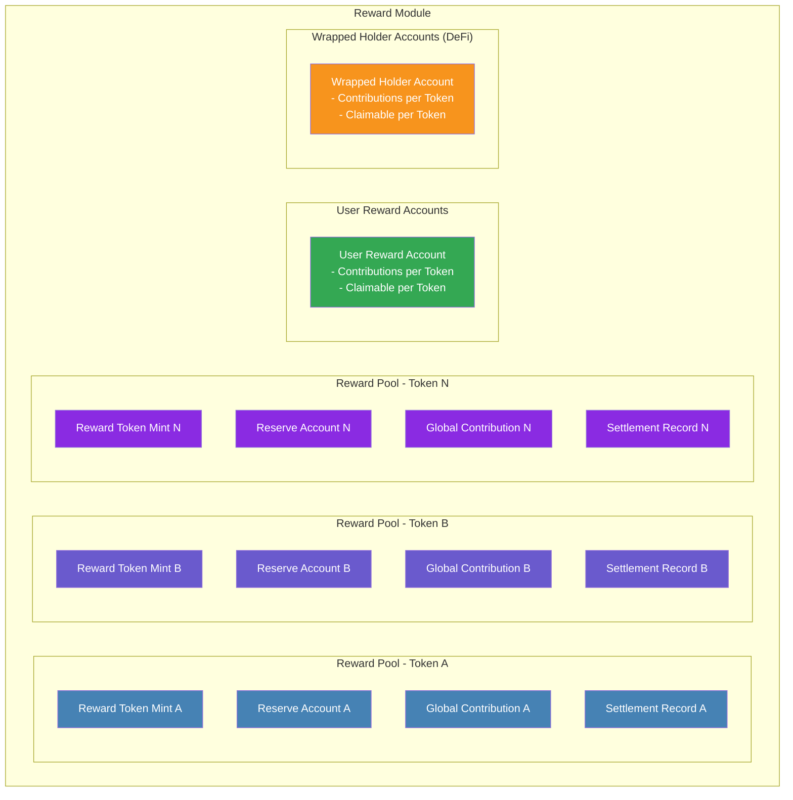

## **Reward Pool Management**

The **Reward Pool** section describes the core structure and processes within the Reward Module of FRAG-22. This section explains how rewards are accumulated, tracked, managed, and ultimately distributed to both individual users and wrapped token holders (DeFi protocols). The reward pool logic ensures accurate, transparent, and fair distribution aligned with each user’s and DeFi protocol’s respective asset holdings.

## **Reward Pool Structure**

The Reward Module is built upon two primary reward pool accounts:

- **Fund Reward Account**
- **User Reward Account**

These pools maintain accurate and real-time reward state information, enabling precise distribution of rewards across different participants in the FRAG-22 ecosystem.

### **1. Fund Reward Account**

The **Fund Reward Account** acts as the central repository for tracking and managing all rewards accrued at the fund-wide level.

**Managed Data:**

- Total accumulated rewards per reward token.
- Global reward state, tracking the overall distribution status across the Fund.

The Fund Reward Account accumulates rewards from various yield sources and periodically updates its state through a mechanism called **Reward Settlement**, ensuring accurate allocation of rewards based on each user’s and wrapped token holder’s relative contributions.

### **2. User Reward Account**

Each user possesses an individual **User Reward Account**, precisely tracking user-specific reward balances and contributions. The user account is updated whenever there is a change in the user’s holdings of receipt tokens (e.g., through deposits, withdrawals, or transfers).

**Managed Data:**

- User-specific accumulated rewards per reward token.
- User’s contribution (holding-based) records.
- Reward claimable status (whether rewards are available to claim).

These individual accounts ensure users have accurate visibility into their accrued rewards and clearly manage their eligibility to claim rewards directly.

## **Reward Pool Update Logic**

Reward pools are systematically updated at two distinct moments:

- **Fund-level Reward Update (Settlement)**:
  - Triggered periodically (manually or through a predefined automated interval).
  - Calculates total accrued rewards since the last settlement.
  - Distributes these rewards proportionally to User Reward Accounts and Wrapped Token Holder Reward Accounts based on recorded contributions.
- **User-level Reward Update (Contribution Tracking)**:
  - Automatically triggered by changes in user receipt token holdings (deposits, withdrawals, transfers).
  - Immediately updates a user’s relative contribution status, which directly influences their accrued rewards in subsequent fund-level settlements.

## **Detailed Reward Pool Procedures**

The following step-by-step procedures detail reward management within the Reward Module, clearly outlining the logic for reward accumulation, tracking, updating, and distribution:

### **Step 1: Contribution Tracking**

**Trigger**: Any change in user holdings of receipt tokens.

**Action**:

- The system immediately recalculates the user’s contribution based on their new token balance.
- Updates the User Reward Account to reflect the new contribution state.
- Simultaneously updates the global contribution state in the Fund Reward Account.

**Outcome**:

- Both user-specific and global contribution states remain current, ensuring accurate reward calculations in subsequent settlements.

### **Step 2: Reward Settlement (Fund-Level)**

**Trigger**: Periodically (e.g., daily, weekly, or upon manual operator invocation).

**Action**:

- The Fund Reward Account aggregates all newly accumulated rewards since the previous settlement.
- It then calculates proportional rewards for each user and wrapped token holder based on recorded contributions during this interval.
- Allocated rewards are then recorded in respective User Reward Accounts and Wrapped Token Holder Reward Accounts, updating claimable balances.

**Outcome**:

- Accurate distribution of rewards proportional to each entity’s contribution, ready to be claimed.

### **Step 3: Reward Claiming (User & DeFi Protocols)**

**Trigger**: User or DeFi protocol initiates reward claiming via the Reward Claim Process.

**Action**:

- Checks the User Reward Account or Wrapped Token Holder Reward Account for available claimable rewards.
- Validates the claim request and confirms sufficient reward tokens are available in the Reward Token Reserve Account.
- Executes the token transfer from the Reward Token Reserve Account directly to the claimant’s designated account.

**Outcome**:

- Successful reward distribution to the claimant.
- Reward accounts update immediately, reducing claimable balances accordingly.

## **Reward Pool Accounting & Recordkeeping**

Every reward-related operation (contribution updates, settlements, and reward claims) updates the following reward accounts to maintain precise records:

- **Fund Reward Account** (Global reward tracking)
- **User Reward Account** (User-specific reward tracking)
- **Wrapped Token Holder Reward Account** (DeFi protocol-specific reward tracking)
- **Reward Token Reserve Account** (Actual reward tokens storage)

This clear separation of responsibilities across dedicated reward accounts ensures high transparency, auditability, and security in reward management.

This comprehensive structure, clearly reflected in the Reward Pool management processes, ensures rewards within FRAG-22 are accurately, transparently, and efficiently distributed according to recorded contributions and asset holdings.