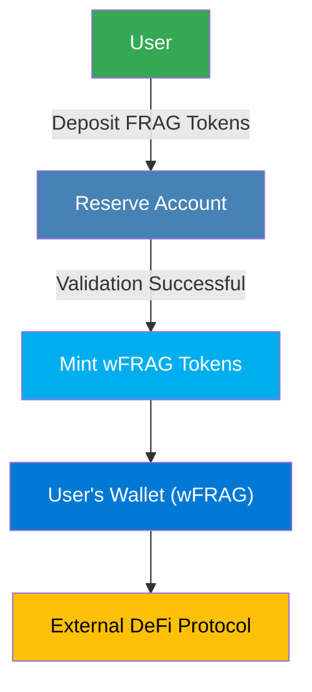

"Wrap" converts FRAG assets into Wrapped FRAG (**wFRAG**), enabling users to participate in external DeFi ecosystems while preserving reward tracking within the FRAG-22 framework.

## Why Wrap?

Wrapping FRAG tokens into wFRAG allows:

- **External Integration:** Enables FRAG assets to seamlessly integrate into external DeFi protocols.
- **Enhanced Liquidity:** Improves asset liquidity and flexibility across DeFi ecosystems.
- **Reward Tracking:** Preserves reward accumulation accurately FRAG-22 while assets are externally deployed.

## Detailed Wrap Procedure

### Step-by-Step Process

1. **User Initiates Wrapping**

   Users initiate the wrapping process by depositing FRAG tokens into the FRAG-22 Reserve Account.

2. **Reserve Account Validation**

   The Reserve Account validates the deposited assets, verifying authenticity and asset balance sufficiency.

3. **wFRAG Token Minting**

   Upon successful validation, the Reserve Account triggers minting of an equivalent amount of wrapped FRAG tokens (wFRAG).

4. **Distribution of wFRAG**

   Minted wFRAG tokens are directly issued to the user's wallet.

5. **External Deployment**

   Users utilize wrapped FRAG tokens into external DeFi protocol vaults, enabling yield generation and liquidity provision and more.

### Technical Components

| Component                      | Role                                   | Description                                            |
| ------------------------------ | -------------------------------------- | ------------------------------------------------------ |
| **Reserve Account**            | Asset Custody & Validation             | Receives FRAG tokens, validates deposits.              |
| **Wrapped Token Mint (wFRAG)** | Token Generation                       | Mints wFRAG tokens proportional to the FRAG deposited. |
| **User's Wallet**              | wFRAG Holding                          | Holds wrapped tokens ready for external deployment.    |
| **External DeFi Protocol**     | Yield Generation & Liquidity Provision | Accepts wFRAG tokens, providing yield and liquidity.   |

### Wrap Operation Benefits

- **Cross-Protocol Utilization:** Empowers users to leverage FRAG tokens in various DeFi environments.
- **Yield Generation:** Facilitates earning additional yield via external DeFi protocols.
- **Secure Tracking:** Ensures continuous and secure tracking of asset contributions and reward accumulation.
