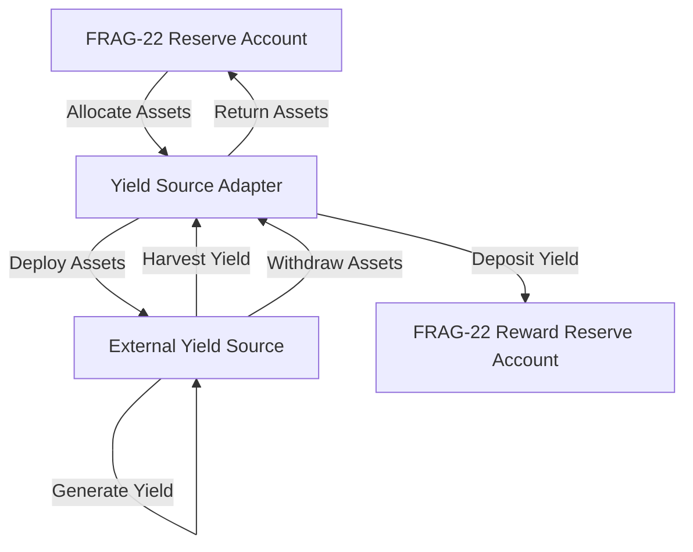
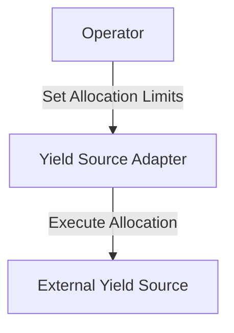

Yield Source Adapters function as standardized interfaces within the FRAG-22 protocol, enabling secure interaction between the internal asset management system and external yield-generating protocols. Each adapter implements clearly defined operations such as asset allocation, yield harvesting, and asset withdrawal, ensuring transparent, consistent, and secure management of deployed assets.

### **Core Functions of Yield Source Adapters**

Each Yield Source Adapter must implement the following standardized functions according to the FRAG-22 protocol specifications:

- **Asset Allocation**
  - **Function:** `allocate(amount: u64)`

    Moves specified assets from the FRAG-22 Reserve Account to the external yield source.
- **Yield Harvesting**
  - **Function:** `harvest() → yield_amount: u64`

    Retrieves generated yields from external yield sources and deposits them into the FRAG-22 Reward Reserve Account.
- **Asset Withdrawal**
  - **Function:** `withdraw(amount: u64)`

    Withdraws assets from the external yield sources back to the FRAG-22 Reserve Account.
- **Status Reporting**
  - **Function:** `report_status() → {allocated_assets: u64, accumulated_yield: u64}`

    Reports the current state of allocated assets and total accumulated yield, ensuring internal transparency and accurate record-keeping.

### **Adapter Structure and Operation Flow**

### **Existing Implementations (by Fragmetric)**

Fragmetric currently maintains two fully operational Yield Source Adapters integrated within FRAG-22:

- **Liquid Staking Adapter**
- **Restaking Adapter**

These existing adapters demonstrate robust and secure integrations that follow the standardized Yield Source Adapter interface.

### **Custom Yield Source Adapter Development**

The modular architecture of FRAG-22 allows external developers to create and propose new adapters that conform to the predefined adapter interface. Operators will review and validate each adapter's implementation before approving any asset allocation.

### **Adapter Activation and Asset Allocation Management**

Operators hold exclusive permissions to manage the activation status and asset allocation parameters for each Yield Source Adapter. This ensures controlled asset exposure, risk management, and compliance with the FRAG-22 asset management strategy.

**Allocation Management Flow:**

The FRAG-22 Yield Source Adapter framework provides a standardized, transparent, and secure approach to extending and integrating various external yield-generation strategies, empowering a scalable and adaptable asset management ecosystem.