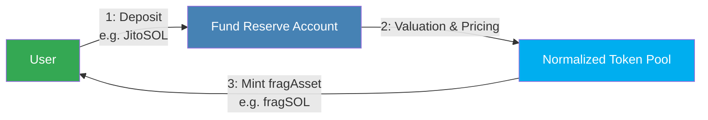
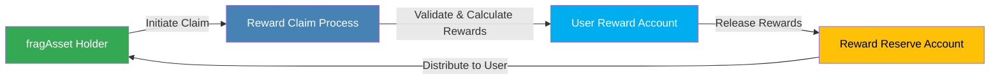
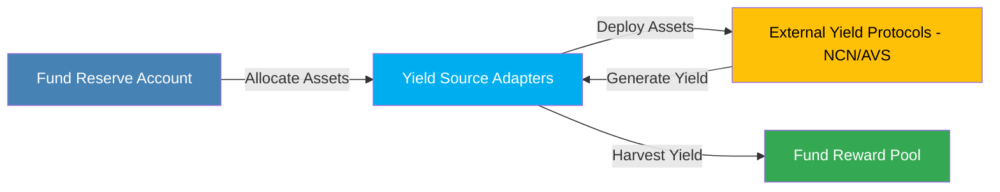
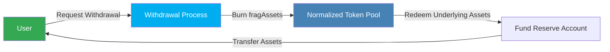

## Overview

Fragmetric's FRAG-22 protocol streamlines asset management on Solana through four core processes: Deposit and Minting, Reward Tracking and Claiming, Yield Optimization, and Unstake and Withdraw. Users deposit supported tokens and receive corresponding fragAssets. Rewards are precisely tracked and distributed, and assets are automatically optimized across yield sources. Withdrawals seamlessly redeem underlying assets, ensuring transparency, efficiency, and maximal returns for all participants.

---

## **1. Deposit and Minting**

Users deposit supported Liquid Staking Tokens (e.g., JitoSOL) into Fragmetric. Fragmetric’s Normalized Token Pool evaluates the deposited asset's real-time value and mints an equivalent amount of fragAssets (e.g., fragSOL), ensuring accurate asset representation.

- **Deposit:** User deposits supported assets into the Fragmetric Reserve.
- **Asset Valuation:** Normalized Token Pool calculates the current value based on integrated pricing sources.
- **Minting:** Users receive fragAssets proportional to their deposits.

---

## **2. Reward Tracking and Reward Claim**

Rewards (staking yields, NCN/AVS rewards) are continuously tracked by the FRAG-22 Reward Module. Contributions are calculated dynamically using Solana's transfer-hook functionality. Users can claim their accrued rewards at any time.

- **Reward Accumulation:** Rewards accrue proportional to user contributions (balance × time held).
- **Transfer Tracking:** Contribution recalculates upon any token transfer (transfer-hook).
- **Claiming Rewards:** Users initiate claims, and rewards transfer from the Reward Reserve.

---

## **3. Yield Optimization**

Fragmetric automatically optimizes yields by strategically allocating deposited assets across yield sources (such as restaking protocols for NCN/AVS networks). Yield Source Adapters regularly harvest these yields, ensuring optimized returns.

- **Allocation:** Assets automatically allocated to highest-yielding sources.
- **Yield Generation:** Assets accrue additional yield through external protocols (NCN/AVS).
- **Yield Harvesting:** Periodically collected and stored in the Reward Pool.

---

## **4. Unstake and Withdraw**

Upon withdrawal request, Fragmetric processes unstaking via the Normalized Token Pool. fragAssets are burned proportionally, redeeming underlying assets back to users based on current valuations.

- **Withdrawal Request:** User initiates unstake and withdrawal.
- **Burn Tokens:** fragAssets burned to redeem underlying assets.
- **Asset Redemption:** Underlying assets proportionally released to the user.

