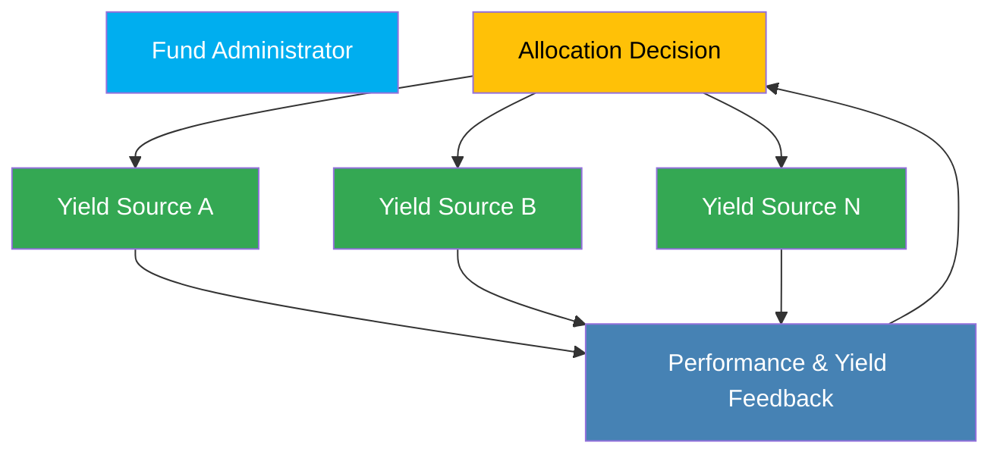
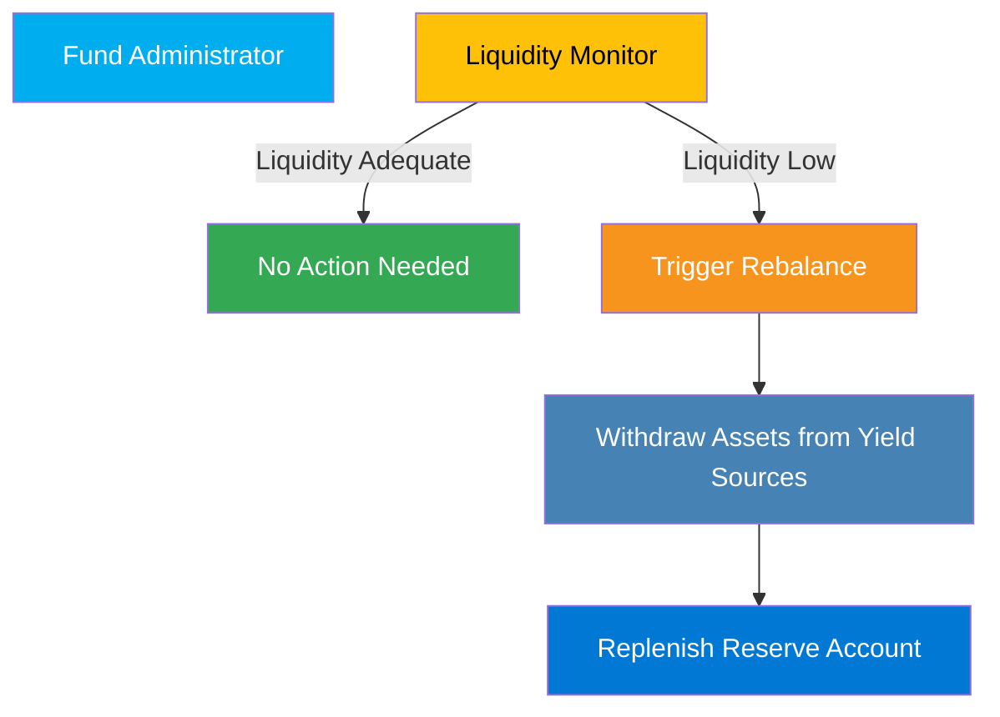

The **Fund Admin** manages core operations related to asset allocation, rebalancing, and reserve account maintenance within the FRAG-22 ecosystem. They ensure optimal asset deployment, maintain liquidity health, and swiftly respond to changing market conditions to secure efficient fund operations.

## Responsibilities and Operations

### 1. Asset Allocation Management

Fund Administrators control asset distribution to various yield sources, ensuring maximized returns and efficiency.

**Core Functions:**

- **Allocate Assets**: Decides how assets are distributed across available yield sources.
- **Rebalance Assets**: Adjust allocations periodically or as needed based on market dynamics and liquidity demands.

**Process Overview:**

### 2. Reserve Account Management

Responsible for maintaining sufficient liquidity within reserve accounts to facilitate smooth user interactions (deposits and withdrawals).

**Core Functions:**

- **Monitor Liquidity**: Continuously assesses reserve liquidity status.
- **Trigger Rebalancing**: Initiates transfers between reserves and yield sources when liquidity thresholds are breached.

**Process Overview:**

## Permissions and Access

Fund Administrators possess:

- **Allocation Authority**: Authorized to set and adjust allocation ratios.
- **Reserve Management Authority**: Can manage and rebalance reserve assets.

This role has restricted permissions to secure operations, limiting the potential risk exposure of the fund's overall assets.

## Importance in FRAG-22

Fund Administrators ensure liquidity and asset management remains responsive and aligned with strategic objectives, providing a crucial layer of operational efficiency and stability to the ecosystem.
