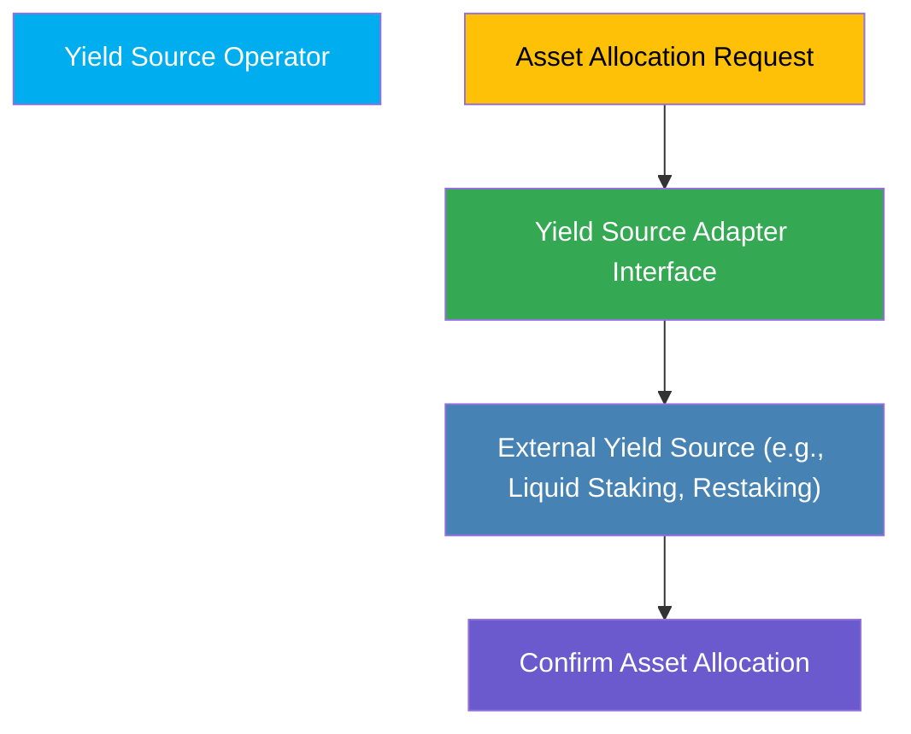
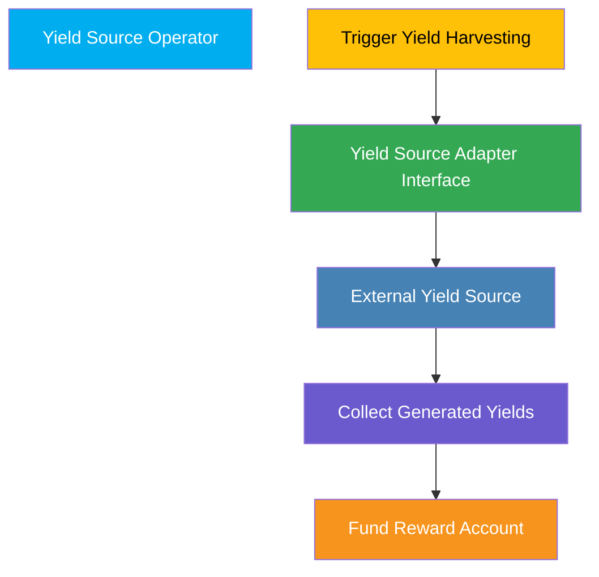
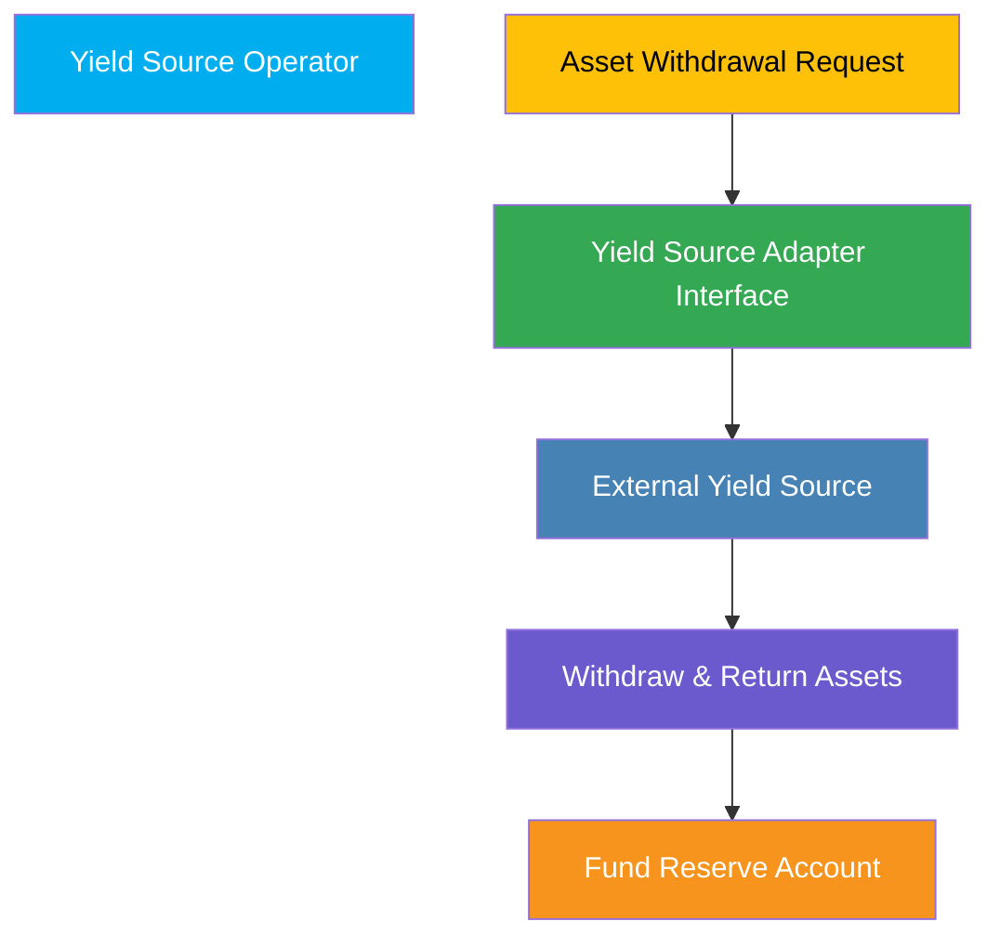

The **Yield Operator** manages asset interactions with external yield-generating sources through standardized yield source adapters. This role ensures efficient allocation of assets, periodic harvesting of generated yields, and the management of asset withdrawals, directly interfacing with external DeFi protocols via defined adapter interfaces.

## Responsibilities and Operations

### 1. Asset Allocation to Yield Sources

The Yield Source Operator allocates assets from the Fund's Reserve Account to designated yield sources using yield source adapters.

**Core Functions:**

- **Deploy Assets:** Transfer assets to external yield sources based on predefined allocation parameters.
- **Manage Allocations:** Monitor asset positions, ensuring optimal utilization and efficient allocation.

**Process Overview:**

### 2. Yield Harvesting & Collection

The Yield Source Operator is responsible for harvesting generated yields from external sources and ensuring these yields are returned securely to the Fund Reward Account.

**Core Functions:**

- **Trigger Harvesting:** Periodically collect yields from allocated external yield sources.
- **Yield Accounting:** Ensure harvested yields are accurately recorded within the Fund Reward Account.

**Process Overview:**

### 3. Asset Withdrawal & Rebalancing

The Yield Source Operator manages withdrawal of assets from yield sources back to the Fund's reserve when rebalancing is needed or withdrawal demands occur.

**Core Functions:**

- **Withdraw Assets:** Execute asset withdrawal from yield sources, converting normalized tokens back into underlying assets.
- **Asset Rebalancing:** Act promptly based on the Fund Administrator's instructions for optimal liquidity and asset management.

**Process Overview:**

## Permissions and Access

Yield Source Operators have:

- **Deployment & Withdrawal Authority:** Authorized to deploy and withdraw assets via yield source adapters.
- **Harvesting Authority:** Explicit permission to trigger yield harvesting operations.
- **Asset Rebalancing Authority:** Ability to execute rebalancing operations based on the Fund Administrator's directives.

These clearly defined permissions ensure secure and efficient yield management.

## Importance in FRAG-22

Yield Source Operators are crucial for maximizing yield generation, managing external yield risks, and ensuring efficient asset utilization, thereby directly contributing to the overall performance and stability of the FRAG-22 system.
