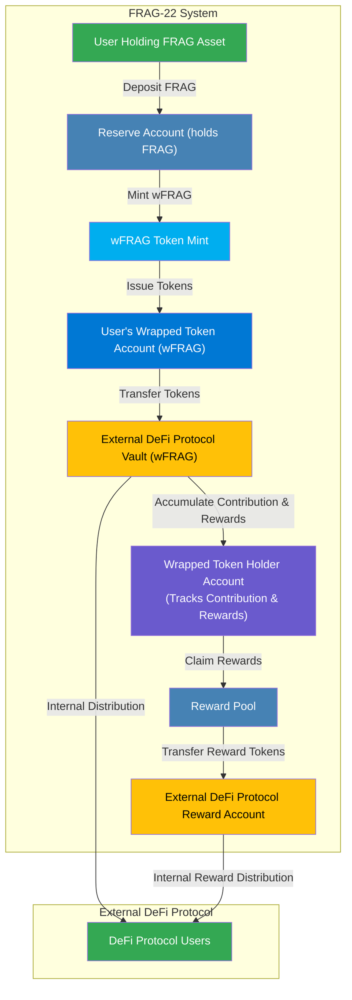

The **Wrap Module** in FRAG-22 provides an essential functionality enabling external DeFi protocols to seamlessly integrate and interact with the FRAG-22 asset ecosystem. Wrapping transforms native FRAG assets into SPL tokens (**wFRAG tokens**) that can be freely utilized within broader DeFi applications.

## Why Wrap Assets?

### Interoperability with DeFi

Wrapping FRAG assets into SPL tokens enhances compatibility with a wide range of external DeFi applications, significantly expanding utility and accessibility for users and protocols.

### Broadened Asset Utilization

By wrapping assets, users can leverage their FRAG positions across multiple platforms, maximizing capital efficiency, liquidity, and yield generation opportunities.

### Simplified Integration

External DeFi protocols gain straightforward integration capability without changing their code to support Token 2022 transfer hook.

### Controlled Reward Distribution

The Wrap Module facilitates controlled and accurate reward distribution to external protocols, allowing DeFi applications to internally distribute rewards proportionally among their users.

## Core Functionalities of the Wrap Module

- **Asset Transformation:**
  Converts native FRAG assets into standardized wrapped tokens (wFRAG).

- **Reward Management:**
  Precisely accumulates and tracks rewards for wrapped tokens, ensuring fair and accurate distribution.

- **Seamless External Interaction:**
  Provides simple entry and exit points between FRAG-22 and external DeFi ecosystems.

- **Enhanced Security:**
  Maintains tight control and transparency throughout wrapping, reward accumulation, and redemption processes.

## High-Level Interaction Overview

The Wrap Module positions FRAG-22 assets for broader decentralized use, combining security, simplicity, and interoperability to extend asset functionality far beyond the native FRAG-22 ecosystem.
