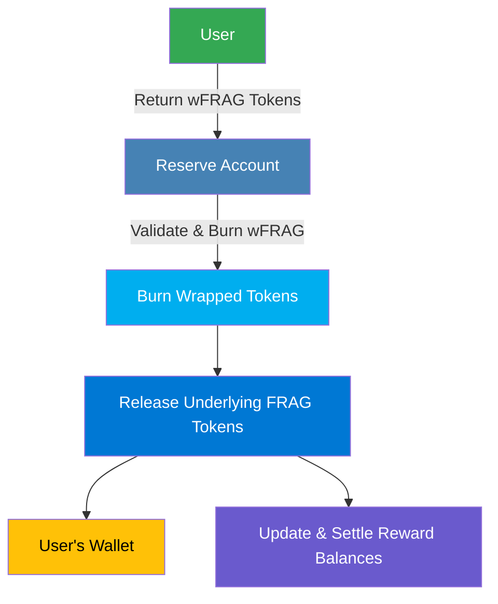

"Unwrap" converts Wrapped FRAG (**wFRAG**) tokens back into original FRAG assets. It ensures accurate redemption of underlying assets and appropriate reward management within FRAG-22.

## Why Unwrap?

Unwrapping wFRAG tokens into original FRAG assets allows users to:

- **Retrieve Original Assets:** Redeem underlying FRAG tokens at any point.
- **Claim Rewards:** Access accumulated rewards and settle any outstanding balances associated with their token holdings.
- **Rebalance Holdings:** Adjust their asset allocation according to changing market conditions or investment strategies.

## Detailed Unwrap Procedure

### Step-by-Step Process

1. **User Initiates Unwrapping**

   Users request unwrapping by returning wrapped FRAG tokens (wFRAG) back to FRAG-22.

2. **Reserve Account Validation**

   The Reserve Account confirms the wFRAG token authenticity and the user's token balance.

3. **Burn wFRAG Tokens**

   Once validated, the corresponding amount of wFRAG tokens is burned to maintain accurate total supply records.

4. **Release Underlying FRAG Assets**

   The Reserve Account releases the equivalent original FRAG tokens to the user's wallet.

5. **Update Reward Accounts**

   Reward contributions and balances are recalculated and settled based on the final holdings after unwrapping.

### Technical Components

| Component                    | Role                         | Description                                                 |
| ---------------------------- | ---------------------------- | ----------------------------------------------------------- |
| **Reserve Account**          | Asset Validation & Custody   | Validates and accepts wFRAG for burning.                    |
| **Wrapped Token Burn**       | Token Supply Management      | Burns returned wFRAG tokens to reduce circulating supply.   |
| **Underlying Asset Release** | FRAG Asset Transfer          | Releases FRAG tokens back to the user’s account.            |
| **Reward Account Update**    | Reward Tracking & Settlement | Recalculates contributions and settles outstanding rewards. |

### Unwrap Operation Benefits

- **Asset Flexibility:** Allows users immediate access to original FRAG assets when desired.
- **Accurate Reward Management:** Ensures precise calculation and settlement of rewards upon redemption.
- **Maintains Asset Integrity:** Keeps asset supply and circulation transparent and correctly balanced within the FRAG-22 ecosystem.
