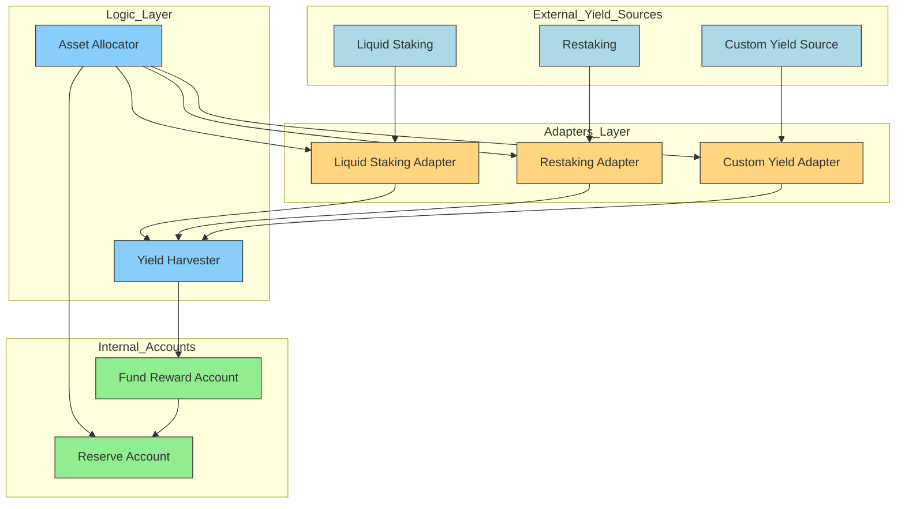

## **FRAG-22: Yield Source Module**

### **Overview**

The Yield Source Module manages the strategic deployment and optimization of assets within the FRAG-22 system, actively allocating user-deposited funds across various external decentralized yield strategies. This module seamlessly connects internal asset management with external yield-generating protocols, maximizing user returns while maintaining efficient liquidity.

The module distinctly organizes responsibilities across three internal layers and clearly interacts with external yield opportunities:

- **Asset Management :**

  Safely maintains and manages the pool of assets (Reserve Account), readying them for strategic deployment to external yield sources.
- **Operator Management :**

  Handles critical operations including asset allocation, periodic rebalancing for optimal yields, and yield harvesting—ensuring asset positions remain optimized and responsive to market conditions.
- **Accounting :**

  Precisely tracks and accumulates the generated yields within the Fund Reward Account, ensuring transparent and accurate reward accounting.

External yield opportunities, such as staking, restaking, liquidity pools, lending protocols, and structured financial products, provide diverse and attractive yield streams. The Yield Source Module strategically integrates these external systems, continuously monitoring and adjusting positions to deliver consistent and optimized returns for users.

### **Comprehensive Structure Diagram**

